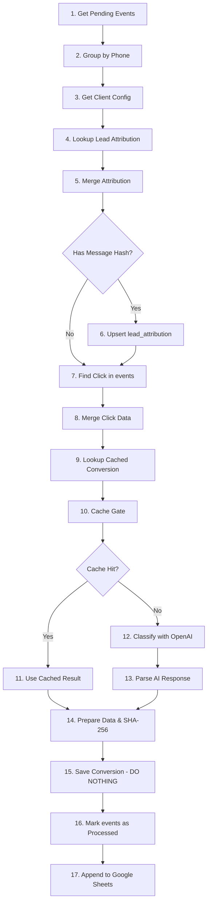

# Arquitectura del Proyecto - WhatsApp Admin Panel

## Actualización 2025-12-20 (estado real + planes inmediatos)

- **Workflow 3 (AI Classification)** ya usa: filtro por `retry_count < 3`, ventana dinámica `click_matching_window_days` en `Find Click`, rama de error que incrementa `retry_count` y guarda `error_message`, y emparejamiento OpenAI resiliente con `Merge OpenAI + Convo`.
- **Dedupe de conversiones:** `ON CONFLICT (external_attrib_id) DO NOTHING` mantiene una sola fila por `project_id + phone_e164 + conversion_name`.
- **Atribución persistente:** `lead_attribution` se actualiza con `click_matching_window_days` por cliente.
- **BD `events`:** incluye `retry_count INTEGER DEFAULT 0` y `error_message TEXT`.
- **Próximo “Workflow 0” (sync Panel → n8n):** Webhook en n8n con header `x-api-key`, hace UPSERT en `clients_config` con el payload del panel. El panel enviará `project_id`, prompt, conversion_config, openai*, click_matching_window_days, message_limit_per_conversation, sheets, etc.
- **Panel (Firebase/React):** Los agentes (subcolección `agents`) permiten múltiples números por cliente; al publicar (`saveConfig`) se lee toda la lista de agentes y se publica en Storage. En la sync hacia n8n se deberá enviar el `phone_filter` principal (o la lista de teléfonos si se decide soportar varios).

## Flujo de Datos y Componentes

```
┌─────────────────────────────────────────────────────────────┐
│                        App.js (27 líneas)                    │
│                                                              │
│  ┌────────────────────────────────────────────────────┐    │
│  │           AuthProvider (Context)                   │    │
│  │  - user, loading, handleLogin, handleLogout        │    │
│  └────────────────────────────────────────────────────┘    │
│                           │                                  │
│              ┌────────────┴────────────┐                    │
│              ▼                         ▼                     │
│      ┌──────────────┐         ┌──────────────┐             │
│      │ LoginScreen  │         │  Dashboard   │             │
│      └──────────────┘         └──────────────┘             │
└─────────────────────────────────────────────────────────────┘
```

---

## Dashboard - Composición de Componentes

```
┌────────────────────────────────────────────────────────────┐
│                      Dashboard.jsx                          │
│                                                             │
│  ┌─────────────────────────────────────────────────────┐  │
│  │  Custom Hooks (Business Logic)                       │  │
│  │  • useProjects(user)  → CRUD proyectos              │  │
│  │  • useAgents(user, selectedProject)  → CRUD agentes │  │
│  │  • useConfig(user, selectedProject)  → Config       │  │
│  └─────────────────────────────────────────────────────┘  │
│                                                             │
│  ┌─────────────┐  ┌──────────────────────────────────┐   │
│  │   Header    │  │       Main Content               │   │
│  │  - Logo     │  │                                   │   │
│  │  - User     │  │  ┌──────────┐  ┌──────────────┐  │   │
│  │  - Logout   │  │  │ Sidebar  │  │ Content Area │  │   │
│  └─────────────┘  │  │          │  │              │  │   │
│                   │  │ Projects │  │ ┌──────────┐ │  │   │
│  ┌─────────────┐  │  │  List    │  │ │ Config   │ │  │   │
│  │   Modals    │  │  │          │  │ │ Section  │ │  │   │
│  │             │  │  │ + New    │  │ └──────────┘ │  │   │
│  │ • Project   │  │  │ Project  │  │              │  │   │
│  │ • Agent     │  │  └──────────┘  │ ┌──────────┐ │  │   │
│  └─────────────┘  │                │ │ Agents   │ │  │   │
│                   │                │ │ Section  │ │  │   │
│                   │                │ └──────────┘ │  │   │
│                   │                │              │  │   │
│                   │                │ ┌──────────┐ │  │   │
│                   │                │ │ Code     │ │  │   │
│                   │                │ │ Section  │ │  │   │
│                   │                │ └──────────┘ │  │   │
│                   │                │              │  │   │
│                   │                │ ┌──────────┐ │  │   │
│                   │                │ │ Preview  │ │  │   │
│                   │                │ │ Section  │ │  │   │
│                   │                │ └──────────┘ │  │   │
│                   │                └──────────────┘  │   │
│                   └──────────────────────────────────┘   │
└────────────────────────────────────────────────────────────┘
```

---

## Flujo de Datos - Firestore Integration

```
┌──────────────┐
│   Firebase   │
│  Firestore   │
└──────┬───────┘
       │
       │ onSnapshot / CRUD operations
       │
       ▼
┌─────────────────────────────────────────┐
│         Custom Hooks Layer              │
│                                         │
│  ┌────────────────┐                    │
│  │ useProjects.js │                    │
│  │  - projects[]  │                    │
│  │  - create()    │                    │
│  │  - delete()    │                    │
│  └────────┬───────┘                    │
│           │                             │
│  ┌────────▼───────┐                    │
│  │ useAgents.js   │                    │
│  │  - agents[]    │                    │
│  │  - save()      │                    │
│  │  - delete()    │                    │
│  └────────┬───────┘                    │
│           │                             │
│  ┌────────▼───────┐                    │
│  │ useConfig.js   │                    │
│  │  - config{}    │                    │
│  │  - save()      │                    │
│  └────────────────┘                    │
└─────────┬───────────────────────────────┘
          │
          ▼
┌──────────────────────────┐
│  UI Components (React)   │
│  - ConfigSection         │
│  - AgentsSection         │
│  - CodeSection           │
│  - etc.                  │
└──────────────────────────┘
```

---

## Estructura de Estados

### AuthContext (Global)
```javascript
{
  user: FirebaseUser | null,
  loading: boolean,
  handleLogin: () => Promise<void>,
  handleLogout: () => Promise<void>
}
```

### useProjects Hook
```javascript
{
  projects: Project[],
  selectedProject: Project | null,
  setSelectedProject: (project) => void,
  createProject: (name) => Promise<void>,
  deleteProject: (id) => Promise<void>
}
```

### useAgents Hook
```javascript
{
  agents: Agent[],
  saveAgent: (form, editing?) => Promise<void>,
  deleteAgent: (id) => Promise<void>
}
```

### useConfig Hook
```javascript
{
  config: Config,
  setConfig: (config) => void,
  saveConfig: () => Promise<void>
}
```

### Dashboard (Local State)
```javascript
{
  showProjectModal: boolean,
  showAgentModal: boolean,
  editingAgent: Agent | null
}
```

---

## Separación de Responsabilidades

### 📁 Contexts
**Responsabilidad:** Estado global compartido
- AuthContext: Autenticación de usuario

### 🎣 Hooks
**Responsabilidad:** Lógica de negocio + integración Firestore
- useProjects: Gestión de proyectos
- useAgents: Gestión de agentes
- useConfig: Configuración del widget

### 🎨 Components
**Responsabilidad:** Renderizado UI puro
- LoginScreen, Header, Sidebar
- Modals: ProjectModal, AgentModal
- Sections: Config, Agents, Code, Preview

### 🔧 Utils
**Responsabilidad:** Funciones auxiliares
- widgetCodeGenerator: Genera código del widget
- trackingUtils: Gestión de Click IDs (gclid/gbraid/wbraid) con validación y GDPR
- staticJsonPublisher: Publicación en Firebase Storage

### 💅 Styles
**Responsabilidad:** Estilos CSS
- App.css: Todos los estilos centralizados

---

## Patrones de Diseño Utilizados

### 1. **Container/Presentational Pattern**
- **Container:** Dashboard.jsx (lógica)
- **Presentational:** Sections/*.jsx (UI pura)

### 2. **Custom Hooks Pattern**
- Encapsulación de lógica reutilizable
- Separación de concerns
- Testing más fácil

### 3. **Context API Pattern**
- Estado global sin prop drilling
- AuthContext para autenticación

### 4. **Compound Components Pattern**
- Modal overlay + modal content
- Secciones independientes pero coordinadas

---

## Ventajas de Esta Arquitectura

### ✅ Mantenibilidad
- Cada componente tiene una responsabilidad única
- Fácil encontrar y corregir bugs
- Código autodocumentado

### ✅ Testabilidad
- Hooks pueden testearse independientemente
- Componentes UI pueden testearse sin lógica
- Mocking simplificado

### ✅ Escalabilidad
- Agregar features nuevas es simple
- No hay código acoplado
- Reutilización de componentes

### ✅ Performance
- CSS en archivo separado (mejor caching)
- Componentes pequeños (re-renders optimizados)
- Posibilidad de lazy loading

### ✅ Developer Experience
- Navegación clara entre archivos
- IntelliSense mejorado
- Menos merge conflicts

---

## Migración del Código Legacy

### Antes (App.js - 1,392 líneas)
```
[CSS inline 878 líneas]
[SVG components 50 líneas]
[useState x15 declaraciones]
[useEffect x3 grandes]
[Handlers x10 funciones]
[JSX rendering 400+ líneas]
[Modales inline]
```

### Después (App.js - 27 líneas)
```javascript
import { AuthProvider, useAuth } from './contexts/AuthContext';
import LoginScreen from './components/LoginScreen';
import Dashboard from './components/Dashboard';
import './styles/App.css';

function App() {
  return (
    <AuthProvider>
      <div className="app-container">
        <AppContent />
      </div>
    </AuthProvider>
  );
}
```

---

## Performance Considerations

### Code Splitting Potencial
```javascript
// Futuro: lazy loading
const Dashboard = React.lazy(() => import('./components/Dashboard'));
const LoginScreen = React.lazy(() => import('./components/LoginScreen'));
```

### Memoization Oportunidades
```javascript
// En AgentsSection.jsx
const AgentCard = React.memo(({ agent, onEdit, onDelete }) => {
  // ...
});
```

### Optimización de Re-renders
- useState local solo donde se necesita
- useCallback para handlers en listas
- useMemo para cálculos costosos

---

## Estructura Final del Proyecto

```
whatsapp-admin-panel/
├── public/
├── src/
│   ├── components/
│   │   ├── modals/
│   │   └── sections/
│   ├── contexts/
│   ├── hooks/
│   ├── styles/
│   ├── utils/
│   ├── App.js (27 líneas)
│   ├── firebase.js
│   └── index.js
├── REFACTORIZACION.md
├── ARQUITECTURA.md
└── package.json
```

**Resultado:** Código mantenible, escalable y profesional ✅

---

## Sistema de Tracking (Google Ads Click IDs)

### Objetivo
Capturar y persistir Click IDs de Google Ads (gclid, gbraid, wbraid) para atribución de conversiones offline en Google Ads.

### Arquitectura del Sistema de Tracking

```
┌─────────────────────────────────────────────────────────────────┐
│                    Usuario visita landing page                   │
│              ejemplo.com?gclid=CjwKCAiA0eTJBhBa...               │
└───────────────────────────┬─────────────────────────────────────┘
                            │
                            ▼
┌─────────────────────────────────────────────────────────────────┐
│         Widget cargado (widgetCodeGenerator.optimized.js)        │
│                                                                  │
│  ┌────────────────────────────────────────────────────────┐    │
│  │   captureClickIdFromUrl() - Auto-ejecuta al cargar     │    │
│  │                                                         │    │
│  │   1. Lee URL params → gclid/gbraid/wbraid              │    │
│  │   2. Genera hash corto (5 chars) → "3KL0P"             │    │
│  │   3. Guarda en _gcl_aw y _gcl_hash:                    │    │
│  │      • Cookie (90 días expira)                         │    │
│  │      • localStorage (backup)                           │    │
│  └────────────────────────────────────────────────────────┘    │
└─────────────────────────────────────────────────────────────────┘
                            │
                            │ Usuario navega por el sitio
                            │ (gclid ya NO está en URL)
                            ▼
┌─────────────────────────────────────────────────────────────────┐
│              Usuario hace clic en widget WhatsApp                │
│                                                                  │
│  ┌────────────────────────────────────────────────────────┐    │
│  │      getStoredClickId() + getStoredHash()              │    │
│  │                                                         │    │
│  │   Lee de:                                              │    │
│  │   1. Cookie _gcl_aw (primero)                          │    │
│  │   2. localStorage _gcl_aw (fallback)                   │    │
│  │                                                         │    │
│  │   Maneja formato Google con puntos: "GCL.123.ABC"      │    │
│  │   → Extrae último segmento: "ABC"                      │    │
│  └────────────────────────────────────────────────────────┘    │
│                                                                  │
│  Mensaje WhatsApp generado:                                     │
│  "¡Hola! 👋 📄 Título 🏷️ Ref: #3KL0P 🔗 https://ejemplo.com" │
└─────────────────────────────────────────────────────────────────┘
                            │
                            ▼
┌─────────────────────────────────────────────────────────────────┐
│                  Webhook enviado a Make/n8n                      │
│                                                                  │
│  {                                                               │
│    "gclid": "CjwKCAiA0eTJBhBa...",   ← CAMPO REQUERIDO GOOGLE │
│    "gclid_hash": "3KL0P",             ← Hash corto referencia   │
│    "phone_e164": "+573123725256",                               │
│    "agent_selected": "Ligia Vargas",                            │
│    "landing_url": "https://ejemplo.com",                        │
│    ...                                                           │
│  }                                                               │
└─────────────────────────────────────────────────────────────────┘
```

### Tipos de Click IDs Soportados

| Tipo | Descripción | Plataforma | Formato Típico |
|------|-------------|------------|----------------|
| `gclid` | Google Click ID | Google Ads (general) | 70-90 chars alfanuméricos |
| `gbraid` | Google Brand Click ID | iOS 14.5+ (Safari) | Similar a gclid |
| `wbraid` | Web Brand Click ID | Cross-platform | Similar a gclid |

### Funciones Principales

#### 1. captureClickIdFromUrl()
```javascript
// Se ejecuta automáticamente al cargar el widget
function captureClickIdFromUrl() {
  // 1. Lee gclid/gbraid/wbraid de URL
  var clickId = URLSearchParams.get('gclid') || ...;

  // 2. Genera hash corto (para referencia humana)
  var hash = getShortHash(clickId); // → "3KL0P"

  // 3. Guarda en cookies y localStorage
  document.cookie = '_gcl_aw=' + clickId + '; expires=90días';
  document.cookie = '_gcl_hash=' + hash + '; expires=90días';
  localStorage.setItem('_gcl_aw', clickId);
  localStorage.setItem('_gcl_hash', hash);
}
```

#### 2. getStoredClickId()
```javascript
// Lee el gclid almacenado (cookie primero, localStorage fallback)
function getStoredClickId() {
  var rawValue = getCookie('_gcl_aw') || localStorage.getItem('_gcl_aw');

  // Maneja formato Google: "GCL.1234567890.ABC123"
  if (rawValue.includes('.')) {
    return rawValue.split('.').pop(); // → "ABC123"
  }

  return rawValue; // → valor directo
}
```

#### 3. getShortHash(str)
```javascript
// Genera hash alfanumérico de 5 caracteres (único por gclid)
function getShortHash(str) {
  var hash = 0;
  for (var i = 0; i < str.length; i++) {
    hash = ((hash << 5) - hash) + str.charCodeAt(i);
  }
  return Math.abs(hash).toString(36).substring(0, 5).toUpperCase();
  // Ejemplo: "CjwKCAiA..." → "3KL0P"
}
```

### Casos de Uso Reales

#### Caso 1: Conversión Inmediata
```
Usuario:
1. Clic en anuncio Google → konversion.studio?gclid=CjwKCAiA0eTJBhBa...
2. Widget captura → _gcl_aw y _gcl_hash
3. Click en WhatsApp → Mensaje: "🏷️ Ref: #3KL0P"
4. Webhook: { gclid: "CjwKCAiA0eTJ...", gclid_hash: "3KL0P" }
```

#### Caso 2: Conversión Tardía (3 días después)
```
Usuario:
1. Día 1: Clic en anuncio → gclid guardado en cookies
2. Día 3: Vuelve directo a konversion.studio (sin gclid en URL)
3. Click en WhatsApp → Lee de cookie _gcl_aw
4. Webhook: { gclid: "CjwKCAiA0eTJ...", gclid_hash: "3KL0P" }
```

#### Caso 3: iOS Safari (gbraid)
```
Usuario iOS 14.5+:
1. Clic en anuncio → ?gbraid=1234567890ABCDEF...
2. Widget captura → _gcl_aw y _gcl_hash
3. Mensaje: "🏷️ Ref: #5XY9Z"
4. Webhook: { gclid: "1234567890ABCDEF...", gclid_hash: "5XY9Z" }
```

### Integración con Google Analytics

```javascript
// Evento automático en dataLayer
window.dataLayer.push({
  event: 'whatsapp_lead_click',
  lead_platform: 'whatsapp',
  agent_name: 'Ligia Vargas',
  lead_traffic: clickId ? 'paid_google' : 'organic',
  lead_ref: hash || 'sin_ref'
});
```

### Por qué _gcl_aw es el campo correcto

Google Ads requiere el campo `gclid` para **conversiones offline**:

```csv
# Archivo CSV para importar a Google Ads
gclid,conversion_name,conversion_time,conversion_value
CjwKCAiA0eTJBhBa...,whatsapp_lead,2025-01-10 15:30:00,50
```

El campo `gclid` debe contener el valor **completo** del click ID (70-90 chars), no un hash corto.

Por eso el webhook envía:
- `gclid`: Valor completo → Para importar a Google Ads
- `gclid_hash`: Hash corto → Para referencia humana en mensajes

### Seguridad y Privacidad

✅ **Cookie SameSite=Lax**: Previene CSRF
✅ **Try-catch global**: No rompe widget si falla tracking
✅ **Sin PII**: Solo almacena Click IDs (no info personal)
✅ **Expiración 90 días**: Cookies auto-expiran
✅ **Compatible Google**: Usa formato estándar `_gcl_aw`

---

## Sistema de Conversiones (n8n + Postgres + OpenAI)

### Objetivo
Sistema de conversión tracking que captura clicks del widget Firebase, mensajes de WhatsApp vía yCloud, y clasifica conversaciones usando IA (OpenAI GPT-4) para atribución offline en Google Ads.

### Arquitectura del Sistema de Conversiones

```
┌─────────────────────────────────────────────────────────────────┐
│                    Usuario visita landing page                   │
│              ejemplo.com?gclid=CjwKCAiA0eTJBhBa...               │
└───────────────────────────┬─────────────────────────────────────┘
                            │
                            ▼
┌─────────────────────────────────────────────────────────────────┐
│         Widget Firebase captura click_id + genera hash           │
│                                                                  │
│  Cookie: _gcl_aw = "CjwKCAiA0eTJ..."                            │
│  Cookie: _gcl_hash = "3KL0P"                                    │
└─────────────────────────┬───────────────────────────────────────┘
                          │
                          │ Usuario hace clic en WhatsApp
                          ▼
┌─────────────────────────────────────────────────────────────────┐
│                     Webhook a n8n Workflow 1                     │
│                     (Click Ingest)                               │
│                                                                  │
│  Payload: {                                                      │
│    project_id: "color-tapetes",                                  │
│    phone_e164: "+573103069696",                                  │
│    gclid: "CjwKCAiA0eTJ...",                                     │
│    gclid_hash: "3KL0P",                                          │
│    landing_url: "https://ejemplo.com"                            │
│  }                                                               │
│                                                                  │
│  ├─→ INSERT INTO events (event_type='click') → Postgres         │
│  └─→ Append Row → Google Sheets (backup)                        │
└─────────────────────────────────────────────────────────────────┘
                          │
                          │ Usuario envía mensaje WhatsApp
                          ▼
┌─────────────────────────────────────────────────────────────────┐
│              yCloud envía webhook a n8n Workflow 2               │
│                   (Message Ingest)                               │
│                                                                  │
│  Webhook: POST /ycloud/:project_id                               │
│  URL: /ycloud/color-tapetes                                      │
│                                                                  │
│  Payload: {                                                      │
│    type: "whatsapp.inbound_message.received",                    │
│    whatsappInboundMessage: {                                     │
│      from: "+573103069696",                                      │
│      to: "+573123725256",                                        │
│      text: { body: "Hola! Necesito información" }                │
│    }                                                             │
│  }                                                               │
│                                                                  │
│  Flujo:                                                          │
│  1. Parse yCloud → Extrae project_id desde URL                   │
│  2. Get Config → SELECT config WHERE project_id                  │
│  3. Validate Phone → IF phone_filter match + status=active       │
│  4. Prepare SQL → Genera query parametrizado                     │
│  5. ├─→ INSERT INTO events (event_type='message_in') → Postgres │
│     └─→ Filter for Sheets → Append Row → Google Sheets          │
└─────────────────────────────────────────────────────────────────┘
                          │
                          │ Cron cada 5 minutos
                          ▼
### Workflow 3: AI Classification & Attribution

Este workflow procesa el histórico de mensajes para clasificar la intención del usuario y atribuir la conversión a un clic publicitario.



**Lógica de Atribución:**
1. **Mensaje**: Si el usuario envía un hash (ej. desde un botón de anuncio).
2. **Persistente**: Si no hay hash, busca en `lead_attribution` (hereda clics anteriores del mismo teléfono).
3. **Histórico**: Busca clics en la tabla `events` dentro de una ventana de 7 días previa al primer mensaje.

**Lógica de Deduplicación:**
Utiliza un `external_attrib_id` compuesto por `project_id + phone + conversion_name`. Esto permite que un usuario sea `lead_qualified` y luego `sale_confirmed` sin duplicar la misma etapa.

```

### Base de Datos PostgreSQL (Railway)

**Tablas:**

1. **`clients_config`** - Configuración multi-tenant
   ```sql
   project_id TEXT PRIMARY KEY
   client_name TEXT
   status TEXT (active/inactive)
   phone_filter TEXT
   sheet_spreadsheet_id TEXT
   sheet_messages_name TEXT
   sheet_conversions_name TEXT
   prompt_template TEXT
   conversion_config JSONB
   openai_model TEXT
   openai_temperature NUMERIC
   openai_max_tokens INTEGER
   click_matching_window_days INTEGER
   message_limit_per_conversation INTEGER
   ```

2. **`events`** - Registro unificado clicks + mensajes
   ```sql
   event_id TEXT PRIMARY KEY
   project_id TEXT REFERENCES clients_config
   event_type TEXT (click, message_in, message_out)
   phone_e164 TEXT
   ts TIMESTAMPTZ
   -- Campos específicos de clicks
   click_id TEXT
   click_id_type TEXT (gclid, gbraid, wbraid)
   click_id_hash TEXT
   landing_url TEXT
   traffic_source TEXT
   -- Campos específicos de mensajes
   message_id TEXT
   message_text TEXT
   direction TEXT (in, out)
   provider_event_type TEXT
   -- Metadata
   payload_raw JSONB (contiene extracted_email, extracted_name)
   processed_at TIMESTAMPTZ
   created_at TIMESTAMPTZ
   ```

3. **`conversions`** - Conversiones clasificadas por IA
   ```sql
   conversion_id TEXT PRIMARY KEY
   project_id TEXT
   phone_e164 TEXT
   click_event_id TEXT
   click_id TEXT
   click_id_type TEXT
   attribution_method TEXT (click_id_hash_match, click_id_match, organic)
   ai_label INTEGER (1=no_qualified, 2=lead_qualified, 3=sale_confirmed)
   ai_confidence NUMERIC
   ai_reason TEXT
   ai_model_used TEXT
   conversion_name TEXT
   conversion_value NUMERIC
   conversion_currency TEXT
   conversion_time TIMESTAMPTZ
   external_attrib_id TEXT UNIQUE
   aggregated_conversation TEXT
   message_count INTEGER
   first_message_ts TIMESTAMPTZ
   last_message_ts TIMESTAMPTZ
   -- Enhanced Conversions (Google Ads)
   lead_email TEXT
   lead_name TEXT
   email_sha256 TEXT
   phone_sha256 TEXT
   -- Metadata
   status TEXT
   sent_at TIMESTAMPTZ
   error_message TEXT
   created_at TIMESTAMPTZ
   updated_at TIMESTAMPTZ
   ```

4. **`lead_attribution`** - Persistencia de atribución por lead
   ```sql
   project_id TEXT
   phone_e164 TEXT
   click_id_hash TEXT
   first_click_ts TIMESTAMPTZ
   last_message_ts TIMESTAMPTZ
   expires_at TIMESTAMPTZ
   updated_at TIMESTAMPTZ
   PRIMARY KEY (project_id, phone_e164)
   ```
   
   **Propósito:** Almacena la atribución de `click_id_hash` por lead (project + phone) para que mensajes tardíos (sin hash en el texto) puedan heredar la atribución del primer contacto. Expira según `click_matching_window_days`.

### n8n Workflows

**Workflow 1: Click Ingest** ✅
- Webhook POST `/click/:project_id`.
- Parse Click: normaliza phone E.164, toma `gclid/gbraid/wbraid` como `click_id`, opcional `gclid_hash`, guarda payload completo.
- Valida `clients_config.status = active`.
- Inserta en `events` (`event_type='click'`) con `click_id`, `click_id_type`, `click_id_hash`, `landing_url`, `traffic_source`, `payload_raw`; Sheets `clicks` es solo respaldo.
- Responde JSON con `success` y `event_id`.

**Workflow 2: Message Ingest (yCloud)** ✅
- Webhook POST `/ycloud/:project_id`.
- Parsea inbound/outbound; outbound solo si `status=delivered`. Inbound intenta extraer `click_id_hash` del texto con regex `#ABCDE`, detecta email si aparece (regex email) y toma nombre si yCloud lo envía; email/nombre se guardan dentro de `payload_raw` (jsonb) en `events` como `extracted_email`/`extracted_name` para no requerir cambios de schema.
- Valida `phone_filter` y `status=active` desde `clients_config`.
- Inserta en `events` (`event_type='message_in/out'`) con `click_id_hash`, `provider_event_type`; Sheets `chats_raw` como backup.
- Responde JSON con `success` y `event_id`.

**Workflow 3: AI Classification** ✅

**Trigger:** Cron cada 5 minutos

**Flujo completo:**

1. **Get Pending Messages** - Query balanceada con CTE:
   - `ROW_NUMBER() OVER (PARTITION BY project_id, phone_e164 ORDER BY ts)` con `rn <= 50`
   - `LIMIT 500` total para evitar sobrecarga
   - Extrae `lead_email` y `lead_name` desde `payload_raw->>'extracted_email'/'extracted_name'`
   - Trae configuración completa: `prompt_template`, `conversion_config`, `openai_model`, `message_limit_per_conversation`, etc.

2. **Has Messages?** - Valida que haya items para procesar

3. **Group by Phone** - Consolida mensajes por `project_id:phone_e164`:
   - Parsea `conversion_config` (maneja string/JSON con defaults)
   - Agrupa mensajes con `click_id_hash`, `lead_email`, `lead_name` por mensaje
   - Acumula `event_ids` para marcar como procesados

4. **Process Conversation** - Prepara conversación para IA:
   - Ordena mensajes por timestamp
   - Usa solo últimos N mensajes (`message_limit_per_conversation` con cap duro de 30)
   - Formatea como "CLIENTE: texto" / "AGENTE: texto"
   - Extrae `click_id_hash`/`lead_email`/`lead_name` del primer mensaje inbound
   - Rate limiting: 500ms delay entre items

5. **Lookup Attribution** - Busca atribución persistida:
   - Query: `SELECT click_id_hash FROM lead_attribution WHERE project_id=$1 AND phone_e164=$2 AND expires_at > NOW()`
   - `alwaysOutputData: true` para no romper flujo si no existe

6. **Merge Attribution** - Combina hash del mensaje con hash almacenado:
   - Usa patrón híbrido de recuperación (pairing + ID matching + index fallback)
   - Si mensaje tiene hash → `click_id_hash_source = 'message'`
   - Si no, pero existe en DB → `click_id_hash_source = 'stored'`
   - Si ninguno → `click_id_hash = null`

7. **Has Click Hash?** - Bifurcación según origen del hash:
   - **True** (source='message'): Va a **Upsert Attribution** + **Find Click**
   - **False** (source='stored' o null): Va solo a **Find Click**

8. **Upsert Attribution** - Persiste atribución en `lead_attribution`:
   - `ON CONFLICT (project_id, phone_e164) DO UPDATE`
   - Actualiza `click_id_hash`, `last_message_ts`, `expires_at`
   - `expires_at = NOW() + click_matching_window_days`

9. **Find Click** - Busca click event en `events`:
    - Query: `WHERE project_id=$1 AND click_id_hash=$2 AND event_type='click' AND ts < first_message_ts AND ts >= NOW() - ($5 || ' days')::interval` (usa `click_matching_window_days` por cliente)
   - `alwaysOutputData: true`

10. **Merge Click Data** - Combina conversación + click:
    - Usa patrón híbrido: intenta pairing directo, luego búsqueda por ID, finalmente fallback por índice
    - Solución a item pairing roto por nodos Postgres

11. **Lookup Cached Conversion** - Busca clasificación previa:
    - Query: `WHERE project_id=$1 AND phone_e164=$2 AND last_message_ts=$3 AND message_count=$4`
    - Si existe → reutiliza `ai_label`, `ai_confidence`, `ai_reason` (evita llamada OpenAI)

12. **Cache Gate** - Merge cache result con conversación:
    - Usa patrón híbrido de recuperación de datos (pairing + ID matching + index fallback)

13. **Cache Hit?** - Bifurcación según cache:
    - **True**: Va a **Use Cached Result** (skip OpenAI)
    - **False**: Va a **Classify with OpenAI**

14. **Classify with OpenAI** (solo si no hay cache):
    - Modelo: `gpt-4o-mini` (configurable por cliente)
    - Prompt: `prompt_template` + conversación formateada
    - Response: `{label: 1|2|3, confidence: 0-1, reason: "..."}`

15. **Parse AI Response** / **Use Cached Result** - Genera objeto de conversión:
    - **Recuperación de datos post-AI**: `Merge OpenAI + Convo` combina por posición la respuesta de OpenAI con la conversación; si llega error de OpenAI se enruta a la rama de retry (`Has Error?` → `Update Retry Count`).
    - Aplica `conversion_config[label]` para obtener `conversion_name`, `conversion_value`, `currency`
    - Genera `conversion_id` único temporal
    - **`external_attrib_id`**: `conv-{project_id}-{phone_e164}-{conversion_name}` (único por teléfono + tipo de conversión)
    - Calcula `email_sha256` y `phone_sha256` (SHA-256 implementado en JS)
    - Define `attribution_method`: `click_id_hash_match` / `click_id_match` / `organic`

16. **Save Conversion** - INSERT con deduplicación y evolución:
    - `ON CONFLICT (external_attrib_id) DO UPDATE SET ... WHERE conversions.ai_label < EXCLUDED.ai_label`
    - **external_attrib_id**: `conv-{project_id}-{phone_e164}` (SIN ai_label para evitar duplicados)
    - **Comportamiento**: Cada teléfono tiene UNA sola conversión que evoluciona de label 1 → 2 → 3
    - **Ejemplo**: `+573001000001` comienza como `no_qualified` (label 1), luego se actualiza a `lead_qualified` (label 2), finalmente a `sale_confirmed` (label 3)
    - **Bloqueo de retroceso**: Solo actualiza si `ai_label < EXCLUDED.ai_label` (no permite 3→1)
    - Incluye: `lead_email`, `lead_name`, `email_sha256`, `phone_sha256`
    - Trunca `aggregated_conversation` a 5000 chars
    - **Fix implementado (2025-12-22)**: Ver [FIX-DUPLICACION-CONVERSIONES.md](../../docs/FIX-DUPLICACION-CONVERSIONES.md)

17. **Prepare Update** + **Mark as Processed**:
    - `UPDATE events SET processed_at=NOW() WHERE event_id = ANY($1::text[])`

18. **Prepare for Sheets** + **Append to Sheets**:
    - Columnas: `click_id`, `conversion_name`, `conversion_time`, `conversion_value`, `conversion_currency`, `phone_e164`, `ai_reason`, `ai_confidence`, `external_attrib_id`, `label_text`, `lead_name`, `email_sha256`, `phone_sha256`

**Optimizaciones clave:**
- **Cache de clasificaciones**: Evita re-clasificar conversaciones idénticas.
- **Atribución persistente**: Mensajes tardíos heredan `click_id_hash` del primer contacto.
- **Item Pairing Resiliente**: Patrón híbrido de 3 capas (Pairing + ID Mapping + Index Fallback) para recuperar datos después de nodos SQL/AI.
- **Deduplicación por conversion_name**: Permite múltiples tipos de conversión por teléfono pero bloquea duplicados exactos para Google Ads (`ON CONFLICT DO NOTHING`).
- **Rate limiting**: 500ms delay para evitar 429 de OpenAI/Sheets.
- **Batch processing**: Procesa hasta 500 eventos por ejecución.

**Workflow 3 → Sheet "conversions":**
- Columnas: `click_id`, `conversion_name`, `conversion_time`, `conversion_value`, `conversion_currency`, `phone_e164`, `ai_reason`, `ai_confidence`, `external_attrib_id`, `label_text`, `lead_name`, `email_sha256`, `phone_sha256`

### Multi-Tenant Architecture

El sistema soporta múltiples clientes usando `project_id` como tenant identifier:

```javascript
// Workflow 2: project_id desde URL
const project_id = $input.first().json.params?.project_id || 'unknown';

// Cada cliente tiene su propia configuración
SELECT * FROM clients_config WHERE project_id = 'color-tapetes';
```

**Clientes actuales:**
- `konversion-web` - Cliente principal
- `color-tapetes` - Cliente adicional

### Integración Firebase ↔ n8n (Sincronización)

Para que los widgets creados en el Admin Panel funcionen con los flujos de IA, los datos deben estar sincronizados entre Firestore (Source of Truth del panel) y PostgreSQL (Source of Truth de n8n).

#### Proceso de Sincronización
1. **Trigger**: El usuario pulsa "Guardar" en el Admin Panel (`useConfig.js` -> `saveConfig`).
2. **Local Save**: Se guarda en Firestore y se publica el JSON en Storage.
3. **Webhook Sync**: El panel hace una llamada `fetch` al webhook de n8n:
   ```javascript
   // Ejemplo de función de conexión
   const syncWithN8n = async (projectId, config) => {
     await fetch('https://n8n.tu-instancia.com/webhook/sync-client', {
       method: 'POST',
       headers: { 
         'Content-Type': 'application/json',
         'x-api-key': 'tu-secreto-compartido'
       },
       body: JSON.stringify({ projectId, config })
     });
   };
   ```
4. **n8n Processing**: Un nuevo flujo (Workflow 0) recibe el JSON y ejecuta un `INSERT ... ON CONFLICT (project_id) DO UPDATE` en la tabla `clients_config`.

#### Funciones involucradas:
- `useProjects.js` -> `createProject()`: Dispara el registro inicial.
- `useConfig.js` -> `saveConfig()`: Sincroniza cambios en prompt, valores de conversión y teléfonos.
- `n8n Sync Workflow`: Procesa el mapeo de campos de Firebase al esquema de Postgres.


### Integración Google Sheets

Ambos workflows escriben a Google Sheets como backup/reporting:

**Workflow 1 → Sheet "clicks":**
- Columnas: `phone_e164`, `gclid`, `gclid_hash`, `landing_url`, `timestamp`

**Workflow 2 → Sheet "chats_raw":**
- Columnas: `phone_e164`, `direction`, `message_text`, `timestamp_iso`, `message_id`

**Lección aprendida:** Google Sheets v4.7 con `autoMapInputData` envía **todos** los campos del input. Solución: agregar nodo intermedio "Filter for Sheets" que retorna solo los campos necesarios.

### Atribución Offline Google Ads

El sistema captura `gclid` para permitir importación de conversiones offline a Google Ads:

**Archivo CSV para importar:**
```csv
gclid,conversion_name,conversion_time,conversion_value
CjwKCAiA0eTJ...,whatsapp_lead,2025-12-16 15:30:00,50
```

**Flujo de atribución:**
1. Usuario clic en anuncio → gclid capturado en cookie
2. Usuario contacta por WhatsApp → gclid enviado en webhook
3. Conversación clasificada por IA → is_conversion = true
4. Query final JOIN events + conversions → Genera CSV
5. Importar CSV a Google Ads → Atribución completada

### Seguridad y Best Practices

✅ **SQL Injection Prevention**: Queries parametrizados ($1, $2, ...)
✅ **Dedupe**: ON CONFLICT (event_id) DO NOTHING
✅ **Multi-tenant Isolation**: Filtro por project_id en todas las queries
✅ **SSL/TLS**: Postgres con SSL mode "Allow" + Ignore SSL Issues
✅ **Phone Validation**: Filtro por phone_filter en cada cliente
✅ **Normalización E.164**: Todos los teléfonos en formato +573XXXXXXXXX
✅ **Backup**: Google Sheets como segunda capa de persistencia

### Lecciones Aprendidas

#### **Workflow 1 y 2:**
1. **n8n Path Parameters**: Vienen en `$input.first().json.params`, no en `$input.params`
2. **Referencias entre nodos**: Usar `$json` en lugar de `$('NodeName').item.json`
3. **Crypto Module**: Deshabilitado en n8n self-hosted, usar `Date.now() + Math.random()`
4. **Google Sheets Filter**: Necesario nodo intermedio para filtrar campos
5. **Railway SSL**: Requiere "Ignore SSL Issues: ON" para certificados autofirmados

#### **Workflow 3 - AI Classification:**
6. **Partición justa en SQL**: la query usa `ROW_NUMBER() OVER (PARTITION BY project_id, phone_e164 ORDER BY ts)` y `rn <= 50` para que ningún proyecto/teléfono acapare el batch.

7. **Matching por hash solamente**: se extrae `click_id_hash` del primer inbound y la búsqueda de click es solo por hash (ventana 7 días, previo al primer mensaje). Sin hash → atribución orgánica (no hay fallback por teléfono).

8. **`alwaysOutputData`** en Postgres críticos (Find Click, Save Conversion, Mark as Processed) para no romper el flujo cuando una query devuelve vacío.

9. **Rate limiting ligero**: 500 ms en `Process Conversation` para evitar 429 de OpenAI/Sheets.

10. **Modos `runOnce`**: `Group by Phone` en batch (`runOnceForAllItems`), el resto item a item (`runOnceForEachItem`).

11. **Item Pairing Resiliente**: Se implementó un patrón híbrido (Pairing + ID Mapping + Index Fallback) para asegurar la integridad de los datos después de nodos que rompen el emparejamiento automático de n8n (Postgres, OpenAI). Ver detalle en el punto 17.

12. **Validaciones tempranas**: parseo de `conversion_config` (string/JSON) con defaults, chequeo de arrays y logs por project/phone para depurar rápido.

13. **Atribución explícita**: `attribution_method` se define por presencia de hash (`click_id_hash_match`) o solo click (`click_id_match`); si no hay click, queda `organic`.

14. **Atribución persistente con `lead_attribution`**: tabla nueva que almacena `click_id_hash` por `(project_id, phone_e164)` con expiración configurable. Permite que mensajes tardíos (sin hash en texto) hereden la atribución del primer contacto. Flujo: `Lookup Attribution` → `Merge Attribution` → `Has Click Hash?` → `Upsert Attribution` (solo si hash viene del mensaje).

15. **Cache de clasificaciones**: antes de llamar OpenAI, consulta `conversions` por `(project_id, phone_e164, last_message_ts, message_count)`. Si existe clasificación previa con mismos parámetros, reutiliza `ai_label`/`ai_confidence`/`ai_reason` y skip OpenAI. Flujo: `Lookup Cached Conversion` → `Cache Gate` → `Cache Hit?` → `Use Cached Result` (con SHA-256 duplicado) o `Classify with OpenAI`.

16. **SHA-256 en JavaScript**: implementación completa de SHA-256 en código JS de n8n (no usa crypto module) para calcular `email_sha256` y `phone_sha256` para Google Ads Enhanced Conversions. Se normaliza email a lowercase y phone a E.164 antes de hashear.

17. **Item Pairing Resiliente (n8n v1)**: Los nodos de PostgreSQL y LangChain (OpenAI) rompen el item pairing automático de n8n. Solución implementada:
    - **Nodos SQL**: Siempre devuelven `project_id` y `phone_e164` explícitamente (incluso con LEFT JOIN a tablas dummy)
    - **Nodos Code post-SQL**: Usan patrón híbrido de 3 capas:
      1. Intentar pairing directo: `$('Node').json`
      2. Búsqueda por ID: `$('Node').all().find(item => item.json.phone_e164 === lookup.phone_e164)`
      3. Fallback por índice: `$('Node').all()[$input.itemIndex]`
    - **Nodos Code post-AI**: Filtran items sin cache antes de usar índice: `allItems.filter(item => item.json.has_cache === false)[$input.itemIndex]`
    - Afecta a: `Merge Attribution`, `Merge Click Data`, `Cache Gate`, `Parse AI Response`

18. **external_attrib_id SIN conversion_name (FIX 2025-12-22)**: Cada teléfono tiene UNA sola conversión que evoluciona. Formato: `conv-{project_id}-{phone_e164}`. Esto previene duplicados cuando el lead evoluciona (1→2→3) y asegura que Google Ads reciba solo una conversión final por usuario. La cláusula `WHERE conversions.ai_label < EXCLUDED.ai_label` bloquea retrocesos.

---
