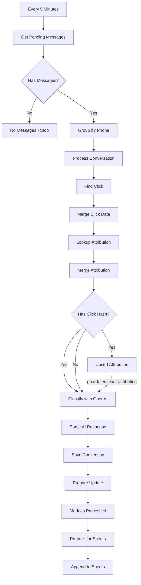

# Arquitectura del Proyecto - WhatsApp Admin Panel

## Actualización 2025-12-20 (estado real + planes inmediatos)

- **Workflow 3 (AI Classification)** ya usa: filtro por `retry_count < 3`, ventana dinámica `click_matching_window_days` en `Find Click`, rama de error que incrementa `retry_count` y guarda `error_message`, y emparejamiento OpenAI resiliente con `Merge OpenAI + Convo`.
- **Dedupe de conversiones:** `ON CONFLICT (external_attrib_id) DO NOTHING` mantiene una sola fila por `project_id + phone_e164 + conversion_name`.
- **Atribución persistente:** `lead_attribution` se actualiza con `click_matching_window_days` por cliente.
- **BD `events`:** incluye `retry_count INTEGER DEFAULT 0` y `error_message TEXT`.
- **Próximo “Workflow 0” (sync Panel → n8n):** Webhook en n8n con header `x-api-key`, hace UPSERT en `clients_config` con el payload del panel. El panel enviará `project_id`, prompt, conversion_config, openai*, click_matching_window_days, message_limit_per_conversation, sheets, etc.
- **Panel (Firebase/React):** Los agentes (subcolección `agents`) permiten múltiples números por cliente; al publicar (`saveConfig`) se lee toda la lista de agentes y se publica en Storage. En la sync hacia n8n se deberá enviar el `phone_filter` principal (o la lista de teléfonos si se decide soportar varios).

## Flujo de Datos y Componentes

```
┌─────────────────────────────────────────────────────────────┐
│                        App.js (27 líneas)                    │
│                                                              │
│  ┌────────────────────────────────────────────────────┐    │
│  │           AuthProvider (Context)                   │    │
│  │  - user, loading, handleLogin, handleLogout        │    │
│  └────────────────────────────────────────────────────┘    │
│                           │                                  │
│              ┌────────────┴────────────┐                    │
│              ▼                         ▼                     │
│      ┌──────────────┐         ┌──────────────┐             │
│      │ LoginScreen  │         │  Dashboard   │             │
│      └──────────────┘         └──────────────┘             │
└─────────────────────────────────────────────────────────────┘
```

---

## Dashboard - Composición de Componentes

```
┌────────────────────────────────────────────────────────────┐
│                      Dashboard.jsx                          │
│                                                             │
│  ┌─────────────────────────────────────────────────────┐  │
│  │  Custom Hooks (Business Logic)                       │  │
│  │  • useProjects(user)  → CRUD proyectos              │  │
│  │  • useAgents(user, selectedProject)  → CRUD agentes │  │
│  │  • useConfig(user, selectedProject)  → Config       │  │
│  └─────────────────────────────────────────────────────┘  │
│                                                             │
│  ┌─────────────┐  ┌──────────────────────────────────┐   │
│  │   Header    │  │       Main Content               │   │
│  │  - Logo     │  │                                   │   │
│  │  - User     │  │  ┌──────────┐  ┌──────────────┐  │   │
│  │  - Logout   │  │  │ Sidebar  │  │ Content Area │  │   │
│  └─────────────┘  │  │          │  │              │  │   │
│                   │  │ Projects │  │ ┌──────────┐ │  │   │
│  ┌─────────────┐  │  │  List    │  │ │ Config   │ │  │   │
│  │   Modals    │  │  │          │  │ │ Section  │ │  │   │
│  │             │  │  │ + New    │  │ └──────────┘ │  │   │
│  │ • Project   │  │  │ Project  │  │              │  │   │
│  │ • Agent     │  │  └──────────┘  │ ┌──────────┐ │  │   │
│  └─────────────┘  │                │ │ Agents   │ │  │   │
│                   │                │ │ Section  │ │  │   │
│                   │                │ └──────────┘ │  │   │
│                   │                │              │  │   │
│                   │                │ ┌──────────┐ │  │   │
│                   │                │ │ Code     │ │  │   │
│                   │                │ │ Section  │ │  │   │
│                   │                │ └──────────┘ │  │   │
│                   │                │              │  │   │
│                   │                │ ┌──────────┐ │  │   │
│                   │                │ │ Preview  │ │  │   │
│                   │                │ │ Section  │ │  │   │
│                   │                │ └──────────┘ │  │   │
│                   │                └──────────────┘  │   │
│                   └──────────────────────────────────┘   │
└────────────────────────────────────────────────────────────┘
```

---

## Flujo de Datos - Firestore Integration

```
┌──────────────┐
│   Firebase   │
│  Firestore   │
└──────┬───────┘
       │
       │ onSnapshot / CRUD operations
       │
       ▼
┌─────────────────────────────────────────┐
│         Custom Hooks Layer              │
│                                         │
│  ┌────────────────┐                    │
│  │ useProjects.js │                    │
│  │  - projects[]  │                    │
│  │  - create()    │                    │
│  │  - delete()    │                    │
│  └────────┬───────┘                    │
│           │                             │
│  ┌────────▼───────┐                    │
│  │ useAgents.js   │                    │
│  │  - agents[]    │                    │
│  │  - save()      │                    │
│  │  - delete()    │                    │
│  └────────┬───────┘                    │
│           │                             │
│  ┌────────▼───────┐                    │
│  │ useConfig.js   │                    │
│  │  - config{}    │                    │
│  │  - save()      │                    │
│  └────────────────┘                    │
└─────────┬───────────────────────────────┘
          │
          ▼
┌──────────────────────────┐
│  UI Components (React)   │
│  - ConfigSection         │
│  - AgentsSection         │
│  - CodeSection           │
│  - etc.                  │
└──────────────────────────┘
```

---

## Estructura de Estados

### AuthContext (Global)
```javascript
{
  user: FirebaseUser | null,
  loading: boolean,
  handleLogin: () => Promise<void>,
  handleLogout: () => Promise<void>
}
```

### useProjects Hook
```javascript
{
  projects: Project[],
  selectedProject: Project | null,
  setSelectedProject: (project) => void,
  createProject: (name) => Promise<void>,
  deleteProject: (id) => Promise<void>
}
```

### useAgents Hook
```javascript
{
  agents: Agent[],
  saveAgent: (form, editing?) => Promise<void>,
  deleteAgent: (id) => Promise<void>
}
```

### useConfig Hook
```javascript
{
  config: Config,
  setConfig: (config) => void,
  saveConfig: () => Promise<void>
}
```

### Dashboard (Local State)
```javascript
{
  showProjectModal: boolean,
  showAgentModal: boolean,
  editingAgent: Agent | null
}
```

---

## Separación de Responsabilidades

### 📁 Contexts
**Responsabilidad:** Estado global compartido
- AuthContext: Autenticación de usuario

### 🎣 Hooks
**Responsabilidad:** Lógica de negocio + integración Firestore
- useProjects: Gestión de proyectos
- useAgents: Gestión de agentes
- useConfig: Configuración del widget

### 🎨 Components
**Responsabilidad:** Renderizado UI puro
- LoginScreen, Header, Sidebar
- Modals: ProjectModal, AgentModal
- Sections: Config, Agents, Code, Preview

### 🔧 Utils
**Responsabilidad:** Funciones auxiliares
- widgetCodeGenerator: Genera código del widget
- trackingUtils: Gestión de Click IDs (gclid/gbraid/wbraid) con validación y GDPR
- staticJsonPublisher: Publicación en Firebase Storage

### 💅 Styles
**Responsabilidad:** Estilos CSS
- App.css: Todos los estilos centralizados

---

## Patrones de Diseño Utilizados

### 1. **Container/Presentational Pattern**
- **Container:** Dashboard.jsx (lógica)
- **Presentational:** Sections/*.jsx (UI pura)

### 2. **Custom Hooks Pattern**
- Encapsulación de lógica reutilizable
- Separación de concerns
- Testing más fácil

### 3. **Context API Pattern**
- Estado global sin prop drilling
- AuthContext para autenticación

### 4. **Compound Components Pattern**
- Modal overlay + modal content
- Secciones independientes pero coordinadas

---

## Ventajas de Esta Arquitectura

### ✅ Mantenibilidad
- Cada componente tiene una responsabilidad única
- Fácil encontrar y corregir bugs
- Código autodocumentado

### ✅ Testabilidad
- Hooks pueden testearse independientemente
- Componentes UI pueden testearse sin lógica
- Mocking simplificado

### ✅ Escalabilidad
- Agregar features nuevas es simple
- No hay código acoplado
- Reutilización de componentes

### ✅ Performance
- CSS en archivo separado (mejor caching)
- Componentes pequeños (re-renders optimizados)
- Posibilidad de lazy loading

### ✅ Developer Experience
- Navegación clara entre archivos
- IntelliSense mejorado
- Menos merge conflicts

---

## Migración del Código Legacy

### Antes (App.js - 1,392 líneas)
```
[CSS inline 878 líneas]
[SVG components 50 líneas]
[useState x15 declaraciones]
[useEffect x3 grandes]
[Handlers x10 funciones]
[JSX rendering 400+ líneas]
[Modales inline]
```

### Después (App.js - 27 líneas)
```javascript
import { AuthProvider, useAuth } from './contexts/AuthContext';
import LoginScreen from './components/LoginScreen';
import Dashboard from './components/Dashboard';
import './styles/App.css';

function App() {
  return (
    <AuthProvider>
      <div className="app-container">
        <AppContent />
      </div>
    </AuthProvider>
  );
}
```

---

## Performance Considerations

### Code Splitting Potencial
```javascript
// Futuro: lazy loading
const Dashboard = React.lazy(() => import('./components/Dashboard'));
const LoginScreen = React.lazy(() => import('./components/LoginScreen'));
```

### Memoization Oportunidades
```javascript
// En AgentsSection.jsx
const AgentCard = React.memo(({ agent, onEdit, onDelete }) => {
  // ...
});
```

### Optimización de Re-renders
- useState local solo donde se necesita
- useCallback para handlers en listas
- useMemo para cálculos costosos

---

## Estructura Final del Proyecto

```
whatsapp-admin-panel/
├── public/
├── src/
│   ├── components/
│   │   ├── modals/
│   │   └── sections/
│   ├── contexts/
│   ├── hooks/
│   ├── styles/
│   ├── utils/
│   ├── App.js (27 líneas)
│   ├── firebase.js
│   └── index.js
├── REFACTORIZACION.md
├── ARQUITECTURA.md
└── package.json
```

**Resultado:** Código mantenible, escalable y profesional ✅

---

## Sistema de Tracking (Google Ads Click IDs)

### Objetivo
Capturar y persistir Click IDs de Google Ads (gclid, gbraid, wbraid) para atribución de conversiones offline en Google Ads.

### Arquitectura del Sistema de Tracking

```
┌─────────────────────────────────────────────────────────────────┐
│                    Usuario visita landing page                   │
│              ejemplo.com?gclid=CjwKCAiA0eTJBhBa...               │
└───────────────────────────┬─────────────────────────────────────┘
                            │
                            ▼
┌─────────────────────────────────────────────────────────────────┐
│         Widget cargado (widgetCodeGenerator.optimized.js)        │
│                                                                  │
│  ┌────────────────────────────────────────────────────────┐    │
│  │   captureClickIdFromUrl() - Auto-ejecuta al cargar     │    │
│  │                                                         │    │
│  │   1. Lee URL params → gclid/gbraid/wbraid              │    │
│  │   2. Genera hash corto (5 chars) → "3KL0P"             │    │
│  │   3. Guarda en _gcl_aw y _gcl_hash:                    │    │
│  │      • Cookie (90 días expira)                         │    │
│  │      • localStorage (backup)                           │    │
│  └────────────────────────────────────────────────────────┘    │
└─────────────────────────────────────────────────────────────────┘
                            │
                            │ Usuario navega por el sitio
                            │ (gclid ya NO está en URL)
                            ▼
┌─────────────────────────────────────────────────────────────────┐
│              Usuario hace clic en widget WhatsApp                │
│                                                                  │
│  ┌────────────────────────────────────────────────────────┐    │
│  │      getStoredClickId() + getStoredHash()              │    │
│  │                                                         │    │
│  │   Lee de:                                              │    │
│  │   1. Cookie _gcl_aw (primero)                          │    │
│  │   2. localStorage _gcl_aw (fallback)                   │    │
│  │                                                         │    │
│  │   Maneja formato Google con puntos: "GCL.123.ABC"      │    │
│  │   → Extrae último segmento: "ABC"                      │    │
│  └────────────────────────────────────────────────────────┘    │
│                                                                  │
│  Mensaje WhatsApp generado:                                     │
│  "¡Hola! 👋 📄 Título 🏷️ Ref: #3KL0P 🔗 https://ejemplo.com" │
└─────────────────────────────────────────────────────────────────┘
                            │
                            ▼
┌─────────────────────────────────────────────────────────────────┐
│                  Webhook enviado a Make/n8n                      │
│                                                                  │
│  {                                                               │
│    "gclid": "CjwKCAiA0eTJBhBa...",   ← CAMPO REQUERIDO GOOGLE │
│    "gclid_hash": "3KL0P",             ← Hash corto referencia   │
│    "phone_e164": "+573123725256",                               │
│    "agent_selected": "Ligia Vargas",                            │
│    "landing_url": "https://ejemplo.com",                        │
│    ...                                                           │
│  }                                                               │
└─────────────────────────────────────────────────────────────────┘
```

### Tipos de Click IDs Soportados

| Tipo | Descripción | Plataforma | Formato Típico |
|------|-------------|------------|----------------|
| `gclid` | Google Click ID | Google Ads (general) | 70-90 chars alfanuméricos |
| `gbraid` | Google Brand Click ID | iOS 14.5+ (Safari) | Similar a gclid |
| `wbraid` | Web Brand Click ID | Cross-platform | Similar a gclid |

### Funciones Principales

#### 1. captureClickIdFromUrl()
```javascript
// Se ejecuta automáticamente al cargar el widget
function captureClickIdFromUrl() {
  // 1. Lee gclid/gbraid/wbraid de URL
  var clickId = URLSearchParams.get('gclid') || ...;

  // 2. Genera hash corto (para referencia humana)
  var hash = getShortHash(clickId); // → "3KL0P"

  // 3. Guarda en cookies y localStorage
  document.cookie = '_gcl_aw=' + clickId + '; expires=90días';
  document.cookie = '_gcl_hash=' + hash + '; expires=90días';
  localStorage.setItem('_gcl_aw', clickId);
  localStorage.setItem('_gcl_hash', hash);
}
```

#### 2. getStoredClickId()
```javascript
// Lee el gclid almacenado (cookie primero, localStorage fallback)
function getStoredClickId() {
  var rawValue = getCookie('_gcl_aw') || localStorage.getItem('_gcl_aw');

  // Maneja formato Google: "GCL.1234567890.ABC123"
  if (rawValue.includes('.')) {
    return rawValue.split('.').pop(); // → "ABC123"
  }

  return rawValue; // → valor directo
}
```

#### 3. getShortHash(str)
```javascript
// Genera hash alfanumérico de 5 caracteres (único por gclid)
function getShortHash(str) {
  var hash = 0;
  for (var i = 0; i < str.length; i++) {
    hash = ((hash << 5) - hash) + str.charCodeAt(i);
  }
  return Math.abs(hash).toString(36).substring(0, 5).toUpperCase();
  // Ejemplo: "CjwKCAiA..." → "3KL0P"
}
```

### Casos de Uso Reales

#### Caso 1: Conversión Inmediata
```
Usuario:
1. Clic en anuncio Google → konversion.studio?gclid=CjwKCAiA0eTJBhBa...
2. Widget captura → _gcl_aw y _gcl_hash
3. Click en WhatsApp → Mensaje: "🏷️ Ref: #3KL0P"
4. Webhook: { gclid: "CjwKCAiA0eTJ...", gclid_hash: "3KL0P" }
```

#### Caso 2: Conversión Tardía (3 días después)
```
Usuario:
1. Día 1: Clic en anuncio → gclid guardado en cookies
2. Día 3: Vuelve directo a konversion.studio (sin gclid en URL)
3. Click en WhatsApp → Lee de cookie _gcl_aw
4. Webhook: { gclid: "CjwKCAiA0eTJ...", gclid_hash: "3KL0P" }
```

#### Caso 3: iOS Safari (gbraid)
```
Usuario iOS 14.5+:
1. Clic en anuncio → ?gbraid=1234567890ABCDEF...
2. Widget captura → _gcl_aw y _gcl_hash
3. Mensaje: "🏷️ Ref: #5XY9Z"
4. Webhook: { gclid: "1234567890ABCDEF...", gclid_hash: "5XY9Z" }
```

### Integración con Google Analytics

```javascript
// Evento automático en dataLayer
window.dataLayer.push({
  event: 'whatsapp_lead_click',
  lead_platform: 'whatsapp',
  agent_name: 'Ligia Vargas',
  lead_traffic: clickId ? 'paid_google' : 'organic',
  lead_ref: hash || 'sin_ref'
});
```

### Por qué _gcl_aw es el campo correcto

Google Ads requiere el campo `gclid` para **conversiones offline**:

```csv
# Archivo CSV para importar a Google Ads
gclid,conversion_name,conversion_time,conversion_value
CjwKCAiA0eTJBhBa...,whatsapp_lead,2025-01-10 15:30:00,50
```

El campo `gclid` debe contener el valor **completo** del click ID (70-90 chars), no un hash corto.

Por eso el webhook envía:
- `gclid`: Valor completo → Para importar a Google Ads
- `gclid_hash`: Hash corto → Para referencia humana en mensajes

### Seguridad y Privacidad

✅ **Cookie SameSite=Lax**: Previene CSRF
✅ **Try-catch global**: No rompe widget si falla tracking
✅ **Sin PII**: Solo almacena Click IDs (no info personal)
✅ **Expiración 90 días**: Cookies auto-expiran
✅ **Compatible Google**: Usa formato estándar `_gcl_aw`

---

## Sistema de Conversiones (n8n + Postgres + OpenAI)

### Objetivo
Sistema de conversión tracking que captura clicks del widget Firebase, mensajes de WhatsApp vía yCloud, y clasifica conversaciones usando IA (OpenAI GPT-4) para atribución offline en Google Ads.

### Arquitectura del Sistema de Conversiones

```
┌─────────────────────────────────────────────────────────────────┐
│                    Usuario visita landing page                   │
│              ejemplo.com?gclid=CjwKCAiA0eTJBhBa...               │
└───────────────────────────┬─────────────────────────────────────┘
                            │
                            ▼
┌─────────────────────────────────────────────────────────────────┐
│         Widget Firebase captura click_id + genera hash           │
│                                                                  │
│  Cookie: _gcl_aw = "CjwKCAiA0eTJ..."                            │
│  Cookie: _gcl_hash = "3KL0P"                                    │
└─────────────────────────┬───────────────────────────────────────┘
                          │
                          │ Usuario hace clic en WhatsApp
                          ▼
┌─────────────────────────────────────────────────────────────────┐
│                     Webhook a n8n Workflow 1                     │
│                     (Click Ingest)                               │
│                                                                  │
│  Payload: {                                                      │
│    project_id: "color-tapetes",                                  │
│    phone_e164: "+573103069696",                                  │
│    gclid: "CjwKCAiA0eTJ...",                                     │
│    gclid_hash: "3KL0P",                                          │
│    landing_url: "https://ejemplo.com"                            │
│  }                                                               │
│                                                                  │
│  ├─→ INSERT INTO events (event_type='click') → Postgres         │
│  └─→ Append Row → Google Sheets (backup)                        │
└─────────────────────────────────────────────────────────────────┘
                          │
                          │ Usuario envía mensaje WhatsApp
                          ▼
┌─────────────────────────────────────────────────────────────────┐
│              yCloud envía webhook a n8n Workflow 2               │
│                   (Message Ingest)                               │
│                                                                  │
│  Webhook: POST /ycloud/:project_id                               │
│  URL: /ycloud/color-tapetes                                      │
│                                                                  │
│  Payload: {                                                      │
│    type: "whatsapp.inbound_message.received",                    │
│    whatsappInboundMessage: {                                     │
│      from: "+573103069696",                                      │
│      to: "+573123725256",                                        │
│      text: { body: "Hola! Necesito información" }                │
│    }                                                             │
│  }                                                               │
│                                                                  │
│  Flujo:                                                          │
│  1. Parse yCloud → Extrae project_id desde URL                   │
│  2. Get Config → SELECT config WHERE project_id                  │
│  3. Validate Phone → IF phone_filter match + status=active       │
│  4. Prepare SQL → Genera query parametrizado                     │
│  5. ├─→ INSERT INTO events (event_type='message_in') → Postgres │
│     └─→ Filter for Sheets → Append Row → Google Sheets          │
└─────────────────────────────────────────────────────────────────┘
                          │
                          │ Cron cada 5 minutos
                          ▼
### Workflow 3: AI Classification & Attribution (BASIC-WITH-ATTRIBUTION)

Este workflow procesa el histórico de mensajes para clasificar la intención del usuario y atribuir la conversión a un clic publicitario.

**Versión actual:** `Workflow 3 - AI Classification (BASIC-WITH-ATTRIBUTION).json`
**Trigger:** Cron cada 5 minutos
**Arquitectura:** Flujo lineal simple con bifurcaciones para atribución



**Lógica de Atribución (3 capas):**
1. **Hash en mensaje**: Si el usuario envía `#ABCDE` en el texto (desde botón de anuncio).
2. **Atribución persistente**: Si no hay hash en mensaje, busca en `lead_attribution` (hereda clics anteriores del mismo teléfono).
3. **Búsqueda histórica**: Busca clics en `events` por `click_id_hash` dentro de ventana configurable (`click_matching_window_days`).

**Lógica de Deduplicación (Opción A - Múltiples Conversiones):**
Utiliza `external_attrib_id` compuesto por `conv-{project_id}-{phone_e164}-{conversion_name}`.

**Comportamiento:**
- ✅ Permite que un teléfono tenga **3 conversiones** (una por cada tipo: `clic_boton_wa`, `chat_iniciado_wa`, `venta_confirmada_wa`)
- ✅ Previene duplicados del **mismo tipo** (no permite dos `chat_iniciado_wa` para el mismo teléfono)
- ✅ Google Ads recibe **3 eventos** separados para optimizar por cada etapa del funnel

**Ejemplo:**
```
Teléfono: +573001000001
├─ Conversión 1: conv-color-tapetes-+573001000001-clic_boton_wa (value: 0)
├─ Conversión 2: conv-color-tapetes-+573001000001-chat_iniciado_wa (value: 15000)
└─ Conversión 3: conv-color-tapetes-+573001000001-venta_confirmada_wa (value: 85000)
```

```

### Base de Datos PostgreSQL (Railway)

**Tablas:**

1. **`clients_config`** - Configuración multi-tenant
   ```sql
   project_id TEXT PRIMARY KEY
   client_name TEXT
   status TEXT (active/inactive)
   phone_filter TEXT
   sheet_spreadsheet_id TEXT
   sheet_messages_name TEXT
   sheet_conversions_name TEXT
   prompt_template TEXT
   conversion_config JSONB
   openai_model TEXT
   openai_temperature NUMERIC
   openai_max_tokens INTEGER
   click_matching_window_days INTEGER
   message_limit_per_conversation INTEGER
   ```

2. **`events`** - Registro unificado clicks + mensajes
   ```sql
   event_id TEXT PRIMARY KEY
   project_id TEXT REFERENCES clients_config
   event_type TEXT (click, message_in, message_out)
   phone_e164 TEXT
   ts TIMESTAMPTZ
   -- Campos específicos de clicks
   click_id TEXT
   click_id_type TEXT (gclid, gbraid, wbraid)
   click_id_hash TEXT
   landing_url TEXT
   traffic_source TEXT
   -- Campos específicos de mensajes
   message_id TEXT
   message_text TEXT
   direction TEXT (in, out)
   provider_event_type TEXT
   -- Metadata
   payload_raw JSONB (contiene extracted_email, extracted_name)
   processed_at TIMESTAMPTZ
   created_at TIMESTAMPTZ
   ```

3. **`conversions`** - Conversiones clasificadas por IA
   ```sql
   conversion_id TEXT PRIMARY KEY
   project_id TEXT
   phone_e164 TEXT
   click_event_id TEXT
   click_id TEXT
   click_id_type TEXT
   attribution_method TEXT (click_id_hash_match, click_id_match, organic)
   ai_label INTEGER (1=no_qualified, 2=lead_qualified, 3=sale_confirmed)
   ai_confidence NUMERIC
   ai_reason TEXT
   ai_model_used TEXT
   conversion_name TEXT
   conversion_value NUMERIC
   conversion_currency TEXT
   conversion_time TIMESTAMPTZ
   external_attrib_id TEXT UNIQUE
   aggregated_conversation TEXT
   message_count INTEGER
   first_message_ts TIMESTAMPTZ
   last_message_ts TIMESTAMPTZ
   -- Enhanced Conversions (Google Ads)
   lead_email TEXT
   lead_name TEXT
   email_sha256 TEXT
   phone_sha256 TEXT
   -- Metadata
   status TEXT
   sent_at TIMESTAMPTZ
   error_message TEXT
   created_at TIMESTAMPTZ
   updated_at TIMESTAMPTZ
   ```

4. **`lead_attribution`** - Persistencia de atribución por lead
   ```sql
   project_id TEXT
   phone_e164 TEXT
   click_id_hash TEXT
   first_click_ts TIMESTAMPTZ
   last_message_ts TIMESTAMPTZ
   expires_at TIMESTAMPTZ
   updated_at TIMESTAMPTZ
   PRIMARY KEY (project_id, phone_e164)
   ```
   
   **Propósito:** Almacena la atribución de `click_id_hash` por lead (project + phone) para que mensajes tardíos (sin hash en el texto) puedan heredar la atribución del primer contacto. Expira según `click_matching_window_days`.

### n8n Workflows

**Workflow 1: Click Ingest** ✅
- Webhook POST `/click/:project_id`.
- Parse Click: normaliza phone E.164, toma `gclid/gbraid/wbraid` como `click_id`, opcional `gclid_hash`, guarda payload completo.
- Valida `clients_config.status = active`.
- Inserta en `events` (`event_type='click'`) con `click_id`, `click_id_type`, `click_id_hash`, `landing_url`, `traffic_source`, `payload_raw`; Sheets `clicks` es solo respaldo.
- Responde JSON con `success` y `event_id`.

**Workflow 2: Message Ingest (yCloud)** ✅
- Webhook POST `/ycloud/:project_id`.
- Parsea inbound/outbound; outbound solo si `status=delivered`. Inbound intenta extraer `click_id_hash` del texto con regex `#ABCDE`, detecta email si aparece (regex email) y toma nombre si yCloud lo envía; email/nombre se guardan dentro de `payload_raw` (jsonb) en `events` como `extracted_email`/`extracted_name` para no requerir cambios de schema.
- Valida `phone_filter` y `status=active` desde `clients_config`.
- Inserta en `events` (`event_type='message_in/out'`) con `click_id_hash`, `provider_event_type`; Sheets `chats_raw` como backup.
- Responde JSON con `success` y `event_id`.

**Workflow 3: AI Classification (BASIC-WITH-ATTRIBUTION)** ✅

**Trigger:** Cron cada 5 minutos
**Total nodos:** 15
**Arquitectura:** Flujo lineal simple (BASIC) + attribution persistence

---

#### **Flujo Detallado Nodo por Nodo:**

##### **1. Every 5 Minutes** (Schedule Trigger)
- **Tipo:** `n8n-nodes-base.scheduleTrigger`
- **Función:** Dispara el workflow automáticamente cada 5 minutos
- **Configuración:** `interval: 5 minutes`

##### **2. Get Pending Messages** (Postgres Query)
- **Tipo:** `n8n-nodes-base.postgres`
- **Función:** Obtiene eventos pendientes de procesamiento
- **Query SQL:**
  ```sql
  SELECT
    e.event_id, e.project_id, e.phone_e164, e.ts,
    e.message_text, e.direction,
    c.client_name, c.prompt_template, c.conversion_config,
    c.openai_model, c.openai_temperature, c.openai_max_tokens,
    c.click_matching_window_days,
    c.sheet_spreadsheet_id, c.sheet_conversions_name
  FROM events e
  INNER JOIN clients_config c ON e.project_id = c.project_id
  WHERE e.event_type IN ('message_in', 'message_out')
    AND e.processed_at IS NULL
    AND c.status = 'active'
  ORDER BY e.project_id, e.phone_e164, e.ts ASC
  LIMIT 500;
  ```
- **Salida:** Array de eventos con configuración del cliente
- **Notas:**
  - Límite de 500 eventos por ejecución para evitar sobrecarga
  - Solo procesa clientes activos
  - Incluye configuración completa en cada fila

##### **3. Has Messages?** (IF node)
- **Tipo:** `n8n-nodes-base.if`
- **Función:** Valida que haya mensajes para procesar
- **Condición:** `$input.all().length > 0`
- **Salidas:**
  - **TRUE**: Continúa a "Group by Phone"
  - **FALSE**: Va a "No Messages" (termina workflow)

##### **4. Group by Phone** (Code node)
- **Tipo:** `n8n-nodes-base.code`
- **Modo:** `runOnceForAllItems` (procesa todo el batch)
- **Función:** Agrupa mensajes por `project_id:phone_e164`
- **Lógica:**
  ```javascript
  const groups = {};
  for (const item of items) {
    const key = `${item.json.project_id}:${item.json.phone_e164}`;
    if (!groups[key]) {
      groups[key] = {
        project_id: item.json.project_id,
        phone_e164: item.json.phone_e164,
        config: { /* parsea conversion_config */ },
        messages: [],
        event_ids: []
      };
    }
    groups[key].messages.push({
      ts: item.json.ts,
      text: item.json.message_text || '',
      direction: item.json.direction,
      click_id_hash: item.json.click_id_hash || null
    });
    groups[key].event_ids.push(item.json.event_id);
  }
  return Object.values(groups);
  ```
- **Salida:** Array de grupos (1 grupo = 1 conversación completa por teléfono)
- **Manejo de `conversion_config`:**
  - Si viene como string JSON → `JSON.parse()`
  - Si falla → usa defaults:
    ```json
    {
      "1": {"name": "no_qualified", "value": 0, "currency": "COP"},
      "2": {"name": "lead_qualified", "value": 15000, "currency": "COP"},
      "3": {"name": "sale_confirmed", "value": 85000, "currency": "COP"}
    }
    ```

##### **5. Process Conversation** (Code node)
- **Tipo:** `n8n-nodes-base.code`
- **Modo:** `runOnceForEachItem`
- **Función:** Construye la conversación formateada para OpenAI
- **Lógica:**
  ```javascript
  const group = $input.item.json;
  const messages = group.messages;

  // Ordenar por timestamp
  const sortedMessages = [...messages].sort((a, b) =>
    new Date(a.ts) - new Date(b.ts)
  );

  // Formatear conversación
  const conversation = sortedMessages
    .map(m => {
      const direction = m.direction === 'in' ? 'CLIENTE' : 'AGENTE';
      const text = m.text && m.text.trim() ? m.text : '[Multimedia/Sin texto]';
      return `${direction}: ${text}`;
    })
    .join('\n');

  // Extraer click_id_hash del primer mensaje inbound
  const firstInboundMsg = sortedMessages.find(m => m.direction === 'in');
  const click_id_hash = firstInboundMsg?.click_id_hash || null;

  // Rate limiting: 500ms delay
  await new Promise(resolve => setTimeout(resolve, 500));

  return {
    project_id: group.project_id,
    phone_e164: group.phone_e164,
    config: group.config,
    event_ids: group.event_ids,
    aggregated_conversation: conversation,
    message_count: messages.length,
    first_message_ts: sortedMessages[0].ts,
    last_message_ts: sortedMessages[sortedMessages.length - 1].ts,
    click_id_hash,
    click_data: null,
    has_click: false
  };
  ```
- **Salida:** Objeto con conversación agregada + metadata
- **Rate limiting:** 500ms entre items para evitar 429 de OpenAI

##### **6. Find Click** (Postgres Query)
- **Tipo:** `n8n-nodes-base.postgres`
- **Función:** Busca evento de click por `click_id_hash`
- **Query SQL:**
  ```sql
  SELECT
    event_id AS click_event_id,
    click_id,
    click_id_type,
    click_id_hash,
    landing_url
  FROM events
  WHERE project_id = $1
    AND click_id_hash = $2
    AND event_type = 'click'
    AND ts < $3
    AND ts >= NOW() - ($4 || ' days')::interval
  ORDER BY ts DESC
  LIMIT 1;
  ```
- **Parámetros:**
  - `$1`: `project_id`
  - `$2`: `click_id_hash`
  - `$3`: `first_message_ts`
  - `$4`: `click_matching_window_days`
- **Configuración:** `alwaysOutputData: true` (no rompe flujo si no encuentra click)
- **Salida:** Click data o null

##### **7. Merge Click Data** (Code node)
- **Tipo:** `n8n-nodes-base.code`
- **Modo:** `runOnceForEachItem`
- **Función:** Combina conversación + datos de click
- **Lógica (patrón híbrido):**
  ```javascript
  const clickResult = $input.item.json;
  const allConvos = $('Process Conversation').all();

  // 1. Intentar pairing directo
  let convo;
  try { convo = $('Process Conversation').json; } catch(e) {}

  // 2. Si falla, buscar por ID
  if (!convo || convo.phone_e164 !== clickResult.phone_e164) {
    convo = allConvos.find(c =>
      c.json.project_id === clickResult.project_id &&
      c.json.phone_e164 === clickResult.phone_e164
    )?.json || allConvos[$input.itemIndex]?.json;
  }

  return {
    ...convo,
    click_data: clickResult.click_event_id ? {
      click_event_id: clickResult.click_event_id,
      click_id: clickResult.click_id,
      click_id_type: clickResult.click_id_type,
      landing_url: clickResult.landing_url
    } : null,
    has_click: !!clickResult.click_event_id
  };
  ```
- **Salida:** Objeto combinado con todos los datos

##### **8. Lookup Attribution** (Postgres Query)
- **Tipo:** `n8n-nodes-base.postgres`
- **Función:** Busca atribución persistida en `lead_attribution`
- **Query SQL:**
  ```sql
  SELECT
    $1::text AS project_id,
    $2::text AS phone_e164,
    (SELECT click_id_hash FROM lead_attribution
     WHERE project_id = $1 AND phone_e164 = $2
     AND expires_at > NOW()
     ORDER BY updated_at DESC LIMIT 1) AS stored_click_id_hash,
    (SELECT expires_at FROM lead_attribution
     WHERE project_id = $1 AND phone_e164 = $2
     AND expires_at > NOW()
     ORDER BY updated_at DESC LIMIT 1) AS stored_expires_at;
  ```
- **Configuración:** `alwaysOutputData: true`
- **Salida:** `stored_click_id_hash` o null

##### **9. Merge Attribution** (Code node)
- **Tipo:** `n8n-nodes-base.code`
- **Modo:** `runOnceForEachItem`
- **Función:** Combina hash del mensaje con hash almacenado
- **Lógica de prioridad:**
  ```javascript
  const lookup = $input.item.json;
  const allConvos = $('Process Conversation').all();

  // Recuperar conversación (patrón híbrido)
  let convo;
  try { convo = $('Process Conversation').json; } catch(e) {}
  if (!convo || convo.phone_e164 !== lookup.phone_e164) {
    convo = allConvos.find(c =>
      c.json.project_id === lookup.project_id &&
      c.json.phone_e164 === lookup.phone_e164
    )?.json || allConvos[$input.itemIndex]?.json;
  }

  const storedClickIdHash = lookup.stored_click_id_hash || null;
  let click_id_hash = convo.click_id_hash || null;
  let click_id_hash_source = null;

  // Prioridad: mensaje > almacenado > null
  if (click_id_hash) {
    click_id_hash_source = 'message';  // Hash viene del texto del mensaje
  } else if (storedClickIdHash) {
    click_id_hash = storedClickIdHash;
    click_id_hash_source = 'stored';   // Hash viene de lead_attribution
  }

  return {
    ...convo,
    click_id_hash,
    click_id_hash_source
  };
  ```
- **Salida:** Conversación con `click_id_hash` + `click_id_hash_source`

##### **10. Has Click Hash?** (IF node)
- **Tipo:** `n8n-nodes-base.if`
- **Función:** Bifurcación según presencia de `click_id_hash`
- **Condición:** `{{ $json.click_id_hash }}` is not empty
- **Salidas:**
  - **TRUE**: Va a "Upsert Attribution" + "Classify with OpenAI" (en paralelo)
  - **FALSE**: Va solo a "Classify with OpenAI"
- **Nota importante:** Ambas salidas van a OpenAI, pero solo TRUE actualiza `lead_attribution`

##### **11. Upsert Attribution** (Postgres Query)
- **Tipo:** `n8n-nodes-base.postgres`
- **Función:** Guarda/actualiza atribución en `lead_attribution`
- **Query SQL:**
  ```sql
  INSERT INTO lead_attribution (
    project_id, phone_e164, click_id_hash,
    first_click_ts, last_message_ts, expires_at, updated_at
  ) VALUES (
    $1, $2, $3, $4, $5,
    NOW() + ($6 || ' days')::interval,
    NOW()
  )
  ON CONFLICT (project_id, phone_e164) DO UPDATE SET
    click_id_hash = EXCLUDED.click_id_hash,
    first_click_ts = LEAST(lead_attribution.first_click_ts, EXCLUDED.first_click_ts),
    last_message_ts = EXCLUDED.last_message_ts,
    expires_at = EXCLUDED.expires_at,
    updated_at = NOW()
  RETURNING project_id;
  ```
- **Parámetros:**
  - `$1`: `project_id`
  - `$2`: `phone_e164`
  - `$3`: `click_id_hash`
  - `$4`: `first_message_ts`
  - `$5`: `last_message_ts`
  - `$6`: `click_matching_window_days` (dinámico por cliente)
- **Configuración:** `alwaysOutputData: true`
- **Comportamiento:**
  - Si no existe → INSERT nuevo registro
  - Si existe → UPDATE con:
    - `first_click_ts` = el más antiguo (LEAST)
    - `last_message_ts` = el más reciente
    - `expires_at` = NOW() + ventana de días
- **Nota:** Este nodo NO envía output a ningún otro nodo (termina el flujo)

##### **12. Classify with OpenAI** (OpenAI node)
- **Tipo:** `@n8n/n8n-nodes-langchain.openAi`
- **Función:** Clasifica la conversación usando GPT-4o-mini
- **Modelo:** `gpt-4o-mini` (configurable por cliente en `config.openai_model`)
- **Messages:**
  - **System:** `{{ $json.config.prompt_template }}`
  - **User:**
    ```
    Conversación de WhatsApp:

    {{ $json.aggregated_conversation }}

    Clasifica esta conversación según las reglas definidas. Responde SOLO con el JSON.
    ```
- **Options:**
  - `maxTokens`: 150
  - `temperature`: 0.3
- **Expected response:**
  ```json
  {
    "label": 1,  // 1, 2, o 3
    "value": 0,  // valor de conversión
    "confidence": 0.95,  // 0.0 - 1.0
    "reason": "Breve explicación de por qué asignaste este label"
  }
  ```
- **Entrada desde:** "Has Click Hash?" (ambas salidas TRUE y FALSE)
- **Salida:** Respuesta de OpenAI con clasificación

##### **13. Parse AI Response** (Code node)
- **Tipo:** `n8n-nodes-base.code`
- **Modo:** `runOnceForEachItem`
- **Función:** Parsea respuesta de OpenAI + genera objeto de conversión
- **Lógica completa:**
  ```javascript
  // Función SHA-256 implementada (no usa crypto module)
  function sha256(ascii) {
    // ... implementación completa SHA-256 ...
    return result; // hash de 64 chars
  }

  const item = $input.item.json;
  const convo_data = item;

  // Extraer content de OpenAI
  const content = item.message?.content || item.choices?.[0]?.message?.content || null;

  // Limpiar y parsear respuesta
  const cleanContent = content
    .replace(/```json\\n?/g, '')
    .replace(/```\\n?/g, '')
    .trim();
  const ai_result = JSON.parse(cleanContent);

  // Aplicar defaults
  if (typeof ai_result.label === 'undefined') ai_result.label = 1;
  if (typeof ai_result.confidence === 'undefined') ai_result.confidence = 0.5;
  if (!ai_result.reason) ai_result.reason = 'Clasificacion automatica';
  if (![1, 2, 3].includes(ai_result.label)) ai_result.label = 1;

  // Obtener conversion_config para este label
  const conversion_config = convo_data.config.conversion_config[ai_result.label.toString()] ||
    { name: 'unknown', value: 0, currency: 'COP' };

  // Generar IDs
  const conversion_id = `conv_${Date.now()}_${Math.random().toString(36).substring(2, 10)}`;

  // 🔑 CLAVE: external_attrib_id usa conversion_name
  const external_attrib_id = `conv-${convo_data.project_id}-${convo_data.phone_e164}-${conversion_config.name}`;

  // Calcular SHA-256 para Enhanced Conversions
  const lead_email = (convo_data.lead_email || '').trim().toLowerCase() || null;
  const email_sha256 = lead_email ? sha256(lead_email) : null;
  const phone_sha256 = convo_data.phone_e164 ? sha256(convo_data.phone_e164) : null;

  // Definir attribution_method
  let attribution_method = 'organic';
  if (convo_data.click_data && convo_data.click_data.click_id) {
    attribution_method = convo_data.click_data.click_id_hash ?
      'click_id_hash_match' : 'click_id_match';
  }

  return {
    conversion_id,
    project_id: convo_data.project_id,
    phone_e164: convo_data.phone_e164,
    click_event_id: convo_data.click_data?.click_event_id || null,
    click_id: convo_data.click_data?.click_id || null,
    click_id_type: convo_data.click_data?.click_id_type || null,
    attribution_method,
    ai_label: ai_result.label,
    ai_confidence: ai_result.confidence,
    ai_reason: ai_result.reason,
    ai_model_used: convo_data.config.openai_model || 'gpt-4o-mini',
    conversion_name: conversion_config.name,
    conversion_value: conversion_config.value,
    conversion_currency: conversion_config.currency || 'COP',
    conversion_time: new Date().toISOString(),
    external_attrib_id,
    aggregated_conversation: convo_data.aggregated_conversation,
    message_count: convo_data.message_count,
    first_message_ts: convo_data.first_message_ts,
    last_message_ts: convo_data.last_message_ts,
    event_ids: convo_data.event_ids,
    config: convo_data.config,
    lead_email,
    lead_name: (convo_data.lead_name && String(convo_data.lead_name).trim()) || null,
    email_sha256,
    phone_sha256
  };
  ```
- **Salida:** Objeto completo de conversión listo para guardar

##### **14. Save Conversion** (Postgres Query)
- **Tipo:** `n8n-nodes-base.postgres`
- **Función:** Inserta conversión con deduplicación por `external_attrib_id`
- **Query SQL:**
  ```sql
  INSERT INTO conversions (
    conversion_id, project_id, phone_e164, click_event_id,
    click_id, click_id_type, attribution_method,
    ai_label, ai_confidence, ai_reason, ai_model_used,
    conversion_name, conversion_value, conversion_currency, conversion_time,
    external_attrib_id,
    aggregated_conversation, message_count, first_message_ts, last_message_ts,
    status, created_at
  ) VALUES (
    $1,$2,$3,$4,$5,$6,$7,$8,$9,$10,$11,$12,$13,$14,$15,$16,$17,$18,$19,$20,'pending',NOW()
  )
  ON CONFLICT (external_attrib_id) DO NOTHING
  RETURNING conversion_id;
  ```
- **Parámetros:** 20 parámetros desde `$json.*`
- **Deduplicación:**
  - `ON CONFLICT (external_attrib_id) DO NOTHING`
  - Si ya existe conversión con mismo `conv-{project}-{phone}-{conversion_name}` → **NO inserta**
  - Previene duplicados del **mismo tipo** de conversión
- **Configuración:** `alwaysOutputData: true`
- **Ejemplo:**
  ```
  INSERT: conv-color-tapetes-+573001000001-chat_iniciado_wa → ✅ OK (primera vez)
  INSERT: conv-color-tapetes-+573001000001-chat_iniciado_wa → ❌ SKIP (duplicado)
  INSERT: conv-color-tapetes-+573001000001-venta_confirmada_wa → ✅ OK (diferente tipo)
  ```

##### **15. Prepare Update** + **16. Mark as Processed** (Code + Postgres)
- **Prepare Update:**
  - **Tipo:** `n8n-nodes-base.code`
  - **Función:** Prepara array de event_ids
  ```javascript
  return {
    event_ids_array: $json.event_ids,
    count: $json.event_ids.length
  };
  ```
- **Mark as Processed:**
  - **Tipo:** `n8n-nodes-base.postgres`
  - **Query SQL:**
    ```sql
    UPDATE events
    SET processed_at = NOW()
    WHERE event_id = ANY($1::text[])
    RETURNING event_id;
    ```
  - **Configuración:** `alwaysOutputData: true`
  - **Resultado:** Marca todos los eventos como procesados

##### **17. Prepare for Sheets** + **18. Append to Sheets** (Code + Google Sheets)
- **Prepare for Sheets:**
  - **Tipo:** `n8n-nodes-base.code`
  - **Función:** Filtra campos para Google Sheets
  ```javascript
  return {
    click_id: $json.click_id || '',
    conversion_name: $json.conversion_name,
    conversion_time: $json.conversion_time,
    conversion_value: $json.conversion_value,
    conversion_currency: $json.conversion_currency,
    phone_e164: $json.phone_e164,
    ai_reason: $json.ai_reason,
    ai_confidence: $json.ai_confidence,
    external_attrib_id: $json.external_attrib_id
  };
  ```
- **Append to Sheets:**
  - **Tipo:** `n8n-nodes-base.googleSheets`
  - **Operación:** Append Row
  - **Spreadsheet ID:** `{{ $json.config.sheet_spreadsheet_id }}`
  - **Sheet Name:** `{{ $json.config.sheet_conversions_name }}`
  - **Columnas:** Las definidas en "Prepare for Sheets"

---

#### **Resumen de Optimizaciones:**

- ✅ **Flujo lineal simple**: Basado en BASIC que funciona, sin complejidad innecesaria
- ✅ **Attribution persistence**: 3 capas (mensaje → stored → histórico)
- ✅ **Deduplicación por conversion_name**: Permite múltiples tipos de conversión
- ✅ **Conexión paralela en Has Click Hash?**: Upsert Attribution + OpenAI simultáneos
- ✅ **alwaysOutputData** en todos los nodos Postgres críticos
- ✅ **Rate limiting**: 500ms en Process Conversation
- ✅ **SHA-256 nativo**: Implementado en JS sin crypto module
- ✅ **Patrón híbrido**: Recuperación resiliente de datos post-SQL
- ✅ **external_attrib_id con conversion_name**: Formato `conv-{project}-{phone}-{name}`

**Optimizaciones clave:**
- **Cache de clasificaciones**: Evita re-clasificar conversaciones idénticas.
- **Atribución persistente**: Mensajes tardíos heredan `click_id_hash` del primer contacto.
- **Item Pairing Resiliente**: Patrón híbrido de 3 capas (Pairing + ID Mapping + Index Fallback) para recuperar datos después de nodos SQL/AI.
- **Deduplicación por conversion_name**: Permite múltiples tipos de conversión por teléfono pero bloquea duplicados exactos para Google Ads (`ON CONFLICT DO NOTHING`).
- **Rate limiting**: 500ms delay para evitar 429 de OpenAI/Sheets.
- **Batch processing**: Procesa hasta 500 eventos por ejecución.

**Workflow 3 → Sheet "conversions":**
- Columnas: `click_id`, `conversion_name`, `conversion_time`, `conversion_value`, `conversion_currency`, `phone_e164`, `ai_reason`, `ai_confidence`, `external_attrib_id`, `label_text`, `lead_name`, `email_sha256`, `phone_sha256`

### Multi-Tenant Architecture

El sistema soporta múltiples clientes usando `project_id` como tenant identifier:

```javascript
// Workflow 2: project_id desde URL
const project_id = $input.first().json.params?.project_id || 'unknown';

// Cada cliente tiene su propia configuración
SELECT * FROM clients_config WHERE project_id = 'color-tapetes';
```

**Clientes actuales:**
- `konversion-web` - Cliente principal
- `color-tapetes` - Cliente adicional

### Integración Firebase ↔ n8n (Sincronización)

Para que los widgets creados en el Admin Panel funcionen con los flujos de IA, los datos deben estar sincronizados entre Firestore (Source of Truth del panel) y PostgreSQL (Source of Truth de n8n).

#### Proceso de Sincronización
1. **Trigger**: El usuario pulsa "Guardar" en el Admin Panel (`useConfig.js` -> `saveConfig`).
2. **Local Save**: Se guarda en Firestore y se publica el JSON en Storage.
3. **Webhook Sync**: El panel hace una llamada `fetch` al webhook de n8n:
   ```javascript
   // Ejemplo de función de conexión
   const syncWithN8n = async (projectId, config) => {
     await fetch('https://n8n.tu-instancia.com/webhook/sync-client', {
       method: 'POST',
       headers: { 
         'Content-Type': 'application/json',
         'x-api-key': 'tu-secreto-compartido'
       },
       body: JSON.stringify({ projectId, config })
     });
   };
   ```
4. **n8n Processing**: Un nuevo flujo (Workflow 0) recibe el JSON y ejecuta un `INSERT ... ON CONFLICT (project_id) DO UPDATE` en la tabla `clients_config`.

#### Funciones involucradas:
- `useProjects.js` -> `createProject()`: Dispara el registro inicial.
- `useConfig.js` -> `saveConfig()`: Sincroniza cambios en prompt, valores de conversión y teléfonos.
- `n8n Sync Workflow`: Procesa el mapeo de campos de Firebase al esquema de Postgres.


### Integración Google Sheets

Ambos workflows escriben a Google Sheets como backup/reporting:

**Workflow 1 → Sheet "clicks":**
- Columnas: `phone_e164`, `gclid`, `gclid_hash`, `landing_url`, `timestamp`

**Workflow 2 → Sheet "chats_raw":**
- Columnas: `phone_e164`, `direction`, `message_text`, `timestamp_iso`, `message_id`

**Lección aprendida:** Google Sheets v4.7 con `autoMapInputData` envía **todos** los campos del input. Solución: agregar nodo intermedio "Filter for Sheets" que retorna solo los campos necesarios.

### Atribución Offline Google Ads

El sistema captura `gclid` para permitir importación de conversiones offline a Google Ads:

**Archivo CSV para importar:**
```csv
gclid,conversion_name,conversion_time,conversion_value
CjwKCAiA0eTJ...,whatsapp_lead,2025-12-16 15:30:00,50
```

**Flujo de atribución:**
1. Usuario clic en anuncio → gclid capturado en cookie
2. Usuario contacta por WhatsApp → gclid enviado en webhook
3. Conversación clasificada por IA → is_conversion = true
4. Query final JOIN events + conversions → Genera CSV
5. Importar CSV a Google Ads → Atribución completada

### Seguridad y Best Practices

✅ **SQL Injection Prevention**: Queries parametrizados ($1, $2, ...)
✅ **Dedupe**: ON CONFLICT (event_id) DO NOTHING
✅ **Multi-tenant Isolation**: Filtro por project_id en todas las queries
✅ **SSL/TLS**: Postgres con SSL mode "Allow" + Ignore SSL Issues
✅ **Phone Validation**: Filtro por phone_filter en cada cliente
✅ **Normalización E.164**: Todos los teléfonos en formato +573XXXXXXXXX
✅ **Backup**: Google Sheets como segunda capa de persistencia

### Lecciones Aprendidas

#### **Workflow 1 y 2:**
1. **n8n Path Parameters**: Vienen en `$input.first().json.params`, no en `$input.params`
2. **Referencias entre nodos**: Usar `$json` en lugar de `$('NodeName').item.json`
3. **Crypto Module**: Deshabilitado en n8n self-hosted, usar `Date.now() + Math.random()`
4. **Google Sheets Filter**: Necesario nodo intermedio para filtrar campos
5. **Railway SSL**: Requiere "Ignore SSL Issues: ON" para certificados autofirmados

#### **Workflow 3 - AI Classification:**
6. **Partición justa en SQL**: la query usa `ROW_NUMBER() OVER (PARTITION BY project_id, phone_e164 ORDER BY ts)` y `rn <= 50` para que ningún proyecto/teléfono acapare el batch.

7. **Matching por hash solamente**: se extrae `click_id_hash` del primer inbound y la búsqueda de click es solo por hash (ventana 7 días, previo al primer mensaje). Sin hash → atribución orgánica (no hay fallback por teléfono).

8. **`alwaysOutputData`** en Postgres críticos (Find Click, Save Conversion, Mark as Processed) para no romper el flujo cuando una query devuelve vacío.

9. **Rate limiting ligero**: 500 ms en `Process Conversation` para evitar 429 de OpenAI/Sheets.

10. **Modos `runOnce`**: `Group by Phone` en batch (`runOnceForAllItems`), el resto item a item (`runOnceForEachItem`).

11. **Item Pairing Resiliente**: Se implementó un patrón híbrido (Pairing + ID Mapping + Index Fallback) para asegurar la integridad de los datos después de nodos que rompen el emparejamiento automático de n8n (Postgres, OpenAI). Ver detalle en el punto 17.

12. **Validaciones tempranas**: parseo de `conversion_config` (string/JSON) con defaults, chequeo de arrays y logs por project/phone para depurar rápido.

13. **Atribución explícita**: `attribution_method` se define por presencia de hash (`click_id_hash_match`) o solo click (`click_id_match`); si no hay click, queda `organic`.

14. **Atribución persistente con `lead_attribution`**: tabla nueva que almacena `click_id_hash` por `(project_id, phone_e164)` con expiración configurable. Permite que mensajes tardíos (sin hash en texto) hereden la atribución del primer contacto. Flujo: `Lookup Attribution` → `Merge Attribution` → `Has Click Hash?` → `Upsert Attribution` (solo si hash viene del mensaje).

15. **Cache de clasificaciones**: antes de llamar OpenAI, consulta `conversions` por `(project_id, phone_e164, last_message_ts, message_count)`. Si existe clasificación previa con mismos parámetros, reutiliza `ai_label`/`ai_confidence`/`ai_reason` y skip OpenAI. Flujo: `Lookup Cached Conversion` → `Cache Gate` → `Cache Hit?` → `Use Cached Result` (con SHA-256 duplicado) o `Classify with OpenAI`.

16. **SHA-256 en JavaScript**: implementación completa de SHA-256 en código JS de n8n (no usa crypto module) para calcular `email_sha256` y `phone_sha256` para Google Ads Enhanced Conversions. Se normaliza email a lowercase y phone a E.164 antes de hashear.

17. **Item Pairing Resiliente (n8n v1)**: Los nodos de PostgreSQL y LangChain (OpenAI) rompen el item pairing automático de n8n. Solución implementada:
    - **Nodos SQL**: Siempre devuelven `project_id` y `phone_e164` explícitamente (incluso con LEFT JOIN a tablas dummy)
    - **Nodos Code post-SQL**: Usan patrón híbrido de 3 capas:
      1. Intentar pairing directo: `$('Node').json`
      2. Búsqueda por ID: `$('Node').all().find(item => item.json.phone_e164 === lookup.phone_e164)`
      3. Fallback por índice: `$('Node').all()[$input.itemIndex]`
    - **Nodos Code post-AI**: Filtran items sin cache antes de usar índice: `allItems.filter(item => item.json.has_cache === false)[$input.itemIndex]`
    - Afecta a: `Merge Attribution`, `Merge Click Data`, `Cache Gate`, `Parse AI Response`

18. **external_attrib_id SIN conversion_name (FIX 2025-12-22)**: Cada teléfono tiene UNA sola conversión que evoluciona. Formato: `conv-{project_id}-{phone_e164}`. Esto previene duplicados cuando el lead evoluciona (1→2→3) y asegura que Google Ads reciba solo una conversión final por usuario. La cláusula `WHERE conversions.ai_label < EXCLUDED.ai_label` bloquea retrocesos.

---
