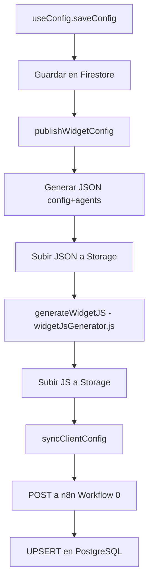
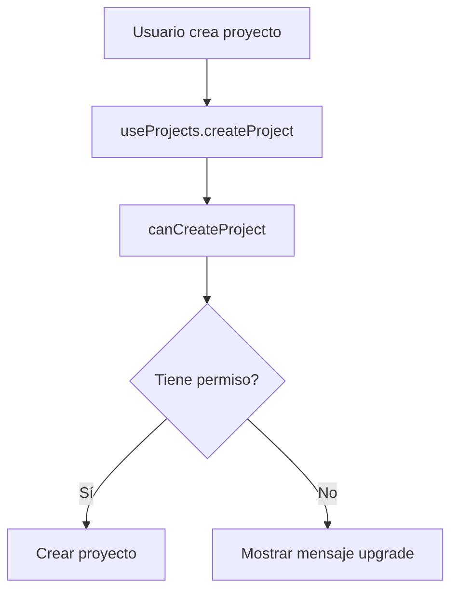
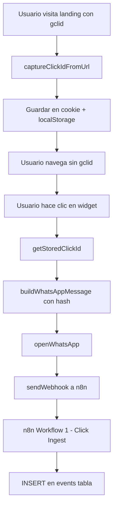
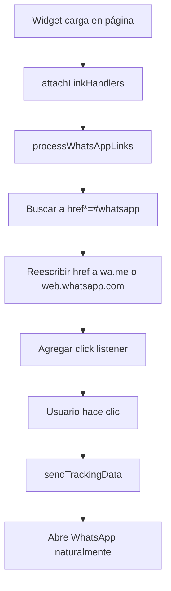

# Utils - Utilidades del Sistema

## Contexto del Negocio

Este proyecto es un **Panel de Administración para Widgets de WhatsApp** integrado con un sistema de conversiones impulsado por IA. El flujo de negocio completo es:

1. **Panel Admin (Firebase/React)**: Los clientes configuran sus widgets de WhatsApp (agentes, mensajes, páginas, prompts de IA)
2. **Widget Público**: Se despliega en los sitios web de los clientes y captura clicks con Google Ads tracking (gclid)
3. **n8n Workflows**: Procesan eventos de clicks y mensajes de WhatsApp (vía yCloud)
4. **PostgreSQL**: Almacena eventos, configuraciones y conversiones
5. **OpenAI**: Clasifica conversaciones en leads calificados, no calificados o ventas confirmadas
6. **Google Sheets**: Backup y reporting de conversiones para importar a Google Ads

### Arquitectura Multi-Tenant

- Cada cliente tiene un `project_id` único
- Configuración almacenada en **Firestore** (panel) y **PostgreSQL** (n8n)
- Los widgets se generan dinámicamente y se publican en **Firebase Storage** como archivos estáticos (JSON + JS)
- Sistema de sincronización bidireccional: Panel → n8n (Workflow 0)

---

## Archivos de Utilidades

### 1. `permissions.js`
**Propósito**: Gestión de permisos y límites por plan (Free, Pro, Enterprise)

**Funciones principales**:
- `hasPermission(userRole, permission)`: Verifica si un rol tiene un permiso específico
- `canCreateProject(userRole, currentProjects, userPlan)`: Valida límite de proyectos según plan
- `canCreateAgent(userRole, projectAgents, userPlan)`: Valida límite de agentes por proyecto
- `getPlanLimits(planId)`: Obtiene límites de un plan
- `formatLimit(limit)`: Formatea límites (-1 = "Ilimitado")

**Relación con otros archivos**:
- Usado por hooks (`useProjects.js`, `useAgents.js`) antes de crear recursos
- Depende de `constants/plans.js` para definiciones de ROLE_PERMISSIONS y PLANS

**Uso típico**:
```javascript
import { canCreateProject } from './permissions';

if (canCreateProject('editor', 2, 'FREE')) {
  // Permitir creación
} else {
  // Mostrar mensaje de upgrade
}
```

---

### 2. `staticJsonPublisher.js`
**Propósito**: Publica configuraciones de widgets como archivos estáticos en Firebase Storage

**Funciones principales**:
- `publishWidgetConfig(userId, projectId, config, agents)`:
  - Genera JSON con config + agents
  - Sube `widgets/{userId}/{projectId}.json` a Storage
  - Genera código JS completo del widget con `generateWidgetJS()`
  - Sube `widgets/{userId}/{projectId}.js` a Storage
  - Retorna URLs públicas de ambos archivos

- `getWidgetPublicUrl(userId, projectId)`: Genera URL del JSON sin subirlo
- `getWidgetJsUrl(userId, projectId)`: Genera URL del JS sin subirlo
- `deleteWidgetConfig(userId, projectId)`: Elimina archivos de Storage

**Relación con otros archivos**:
- **Importa**: `widgetJsGenerator.js` (para generar código JS puro)
- **Usado por**: `useConfig.js` hook cuando se guarda configuración
- **Depende de**: Firebase Storage SDK

**Flujo de publicación**:
```
useConfig.saveConfig()
  → publishWidgetConfig()
    → Sube JSON (config + agents)
    → Genera JS con generateWidgetJS(jsonUrl, projectId)
    → Sube JS a Storage
    → Retorna URLs públicas
```

**Características técnicas**:
- JSON: `cache-control: max-age=300` (5 min)
- JS: `cache-control: max-age=3600` (1 hora)
- Metadata: `projectId`, `lastModified`

---

### 3. `syncClient.js`
**Propósito**: Sincroniza configuración de cliente desde Firebase Panel hacia n8n (PostgreSQL)

**Función principal**:
- `syncClientConfig({ projectId, projectName, config, agents })`:
  - Construye payload con toda la configuración del cliente
  - Envía POST a n8n Workflow 0 (`/webhook/sync-client`)
  - Headers: `x-api-key` para autenticación
  - n8n ejecuta UPSERT en tabla `clients_config` de PostgreSQL

**Payload enviado**:
```javascript
{
  project_id: string,
  client_name: string,
  status: 'active',
  phone_filter: string,              // Número principal del negocio
  prompt_template: string,           // Prompt para OpenAI
  conversion_config: JSON,           // { "1": { name, value }, "2": {...}, "3": {...} }
  openai_model: string,              // "gpt-4o-mini"
  openai_temperature: number,        // 0.3
  openai_max_tokens: number,         // 150
  click_matching_window_days: number, // 60
  message_limit_per_conversation: number, // 15
  sheet_spreadsheet_id: string,
  sheet_messages_name: string,       // "chats_raw"
  sheet_conversions_name: string,    // "conversions"
  agents: [{ id, name, phone, role }]
}
```

**Relación con otros archivos**:
- **Usado por**: `useConfig.js` hook después de `publishWidgetConfig()`
- **Requiere**: Variables de entorno `REACT_APP_N8N_SYNC_URL`, `REACT_APP_N8N_SYNC_SECRET`
- **Integra con**: n8n Workflow 0 (Sync Client)

**Flujo completo de guardado**:
```
1. Usuario guarda config en Panel
2. saveConfig() guarda en Firestore
3. publishWidgetConfig() sube a Storage
4. syncClientConfig() sincroniza a PostgreSQL
5. n8n workflows usan config de PostgreSQL
```

---

### 4. `trackingUtils.js`
**Propósito**: Captura y persiste Google Ads Click IDs (gclid/gbraid/wbraid) con soporte GDPR

**Funciones principales**:

#### Validación
- `isValidClickId(value, type)`: Valida formato de Click IDs (alfanumérico, min 20 chars)

#### Captura y Persistencia
- `captureClickIds(requireConsent)`: Lee gclid/gbraid/wbraid desde URL params y los persiste
- `persistClickId(type, value, useCookies)`: Guarda en localStorage + cookie con metadata
  - Estructura: `{ id, timestamp, source, userAgent }`
  - Cookie 1st-party: `last_{type}`, expiración 90 días

#### Recuperación
- `getBestClickId(maxAgeDays)`: Recupera el mejor Click ID con prioridad:
  1. **URL params** (más confiable)
  2. **localStorage propio** (con validación de edad)
  3. **Cookie propia** (`last_gclid`)
  4. **Cookie de Google** (`_gcl_aw`)

  Retorna: `{ id, type, source, age, valid }`

#### GDPR Compliance
- `hasStorageConsent()`: Verifica consentimiento para cookies/storage
  - Chequea `window.cookieConsentGranted`
  - Chequea `localStorage.getItem('cookie_consent')`

- `setStorageConsent(granted)`: Establece o revoca consentimiento
  - Si granted=true: captura Click IDs
  - Si granted=false: limpia todos los Click IDs

- `clearAllClickIds()`: Elimina todos los Click IDs almacenados

#### Generación de URLs
- `generateWhatsAppURL(phone, message, options)`: Genera URL de WhatsApp con Click ID incluido
  - Formato configurable: `[ref:{id}]`
  - Respeta `maxAgeDays` para validar edad del Click ID

#### Debug
- `getDebugInfo()`: Retorna objeto completo para debugging:
  - Click ID actual
  - URL params
  - Storage
  - Cookies
  - Consentimiento

**Relación con otros archivos**:
- **NO usado directamente** en el panel (es para clientes del widget)
- **Usado en**: Código del widget generado (pero con lógica inline, no importa este archivo)
- **Concepto replicado** en `widgetCodeGenerator.optimized.js` con funciones inline

**Auto-captura**:
```javascript
// Se ejecuta automáticamente al cargar
if (document.readyState === 'loading') {
  document.addEventListener('DOMContentLoaded', () => {
    TrackingUtils.captureClickIds(true);
  });
}
```

**Nota**: Este archivo es una **utilidad avanzada** para tracking robusto, pero el widget usa una versión simplificada inline para reducir tamaño.

---

### 5. `widgetCodeGenerator.optimized.js`
**Propósito**: Genera el código JavaScript completo del widget (versión EMBEBIDA, no archivo separado)

**Función principal**:
- `generateOptimizedWidgetCode(user, selectedProject)`: Retorna string con `<script>` completo

**Características del widget generado**:

#### 1. Tracking de Google Ads
- `captureClickIdFromUrl()`: Captura gclid/gbraid/wbraid al cargar
- `getStoredClickId()`: Lee Click ID de cookie/localStorage
- `getShortHash(str)`: Genera hash de 5 caracteres (ej: "3KL0P")
- Persiste en cookies `_gcl_aw`, `_gcl_hash` (90 días)

#### 2. Construcción de Mensajes
- `buildWhatsAppMessage(customMessage)`:
  - Mensaje base (custom o config)
  - Agrega título de página: `📄 {title}`
  - Agrega ref si hay hash: `🏷️ Ref: #{hash}`
  - Agrega URL limpia: `🔗 {url}`

- `getCurrentUrl()`: Limpia URL de parámetros de tracking (gclid, utm_*, fbclid)

#### 3. Apertura de WhatsApp
- `openWhatsApp(phone, agentName, customMessage)`:
  - **Móvil**: `https://wa.me/{phone}?text=...` (abre app)
  - **Escritorio**: `https://web.whatsapp.com/send?phone={phone}&text=...` (abre web)
  - Envía webhook con tracking completo
  - Push a dataLayer (Google Tag Manager)

#### 4. Enlaces `#whatsapp`
- `attachLinkHandlers(agents)`: Detecta enlaces con `href*="#whatsapp"`
- `processWhatsAppLinks()`:
  - Busca todos los `<a href="...#whatsapp">`
  - Reescribe href a URL de WhatsApp (elimina `#whatsapp`)
  - Agrega `target="_blank"`, `rel="noopener"`
  - Agrega tracking sin `preventDefault()`
  - Soporta atributos:
    - `data-phone`: Teléfono específico
    - `data-name`: Nombre de agente
    - `data-message`: Mensaje personalizado
  - Marca como procesado: `data-wa-processed="true"`

- **MutationObserver**: Detecta enlaces agregados dinámicamente (AJAX/React)

#### 5. Webhook Tracking
- `sendWebhook(data)`: Envía evento a n8n
  - Intenta `navigator.sendBeacon` (más confiable)
  - Fallback a `fetch` con `keepalive: true`

- Payload:
```javascript
{
  gclid: string | null,
  gclid_hash: string | null,
  phone_e164: string,
  agent_selected: string,
  first_click_time_iso: string,
  landing_url: string,
  page_title: string,
  user_agent: string,
  device_type: 'mobile' | 'desktop',
  project_id: string,           // ← Hardcoded en template
  trigger: 'button' | 'link' | 'custom_link'
}
```

#### 6. UI del Widget
- `renderWidget(agents)`:
  - **Un agente**: Botón flotante directo
  - **Múltiples agentes**: Botón + menú desplegable
  - Estilos inline minificados (CSS comprimido en 1 línea)
  - Animación de pulso en botón
  - Responsive (mobile/desktop)

#### 7. Configuración Dinámica
- `loadConfig()`: Carga JSON desde Firebase Storage
  - URL: `https://firebasestorage.googleapis.com/.../widgets/{userId}/{projectId}.json?alt=media`
  - Cache bust: `&t={timestamp}`
  - Estructura JSON: `{ config: {...}, agents: [...] }`

#### 8. Reglas de Visibilidad
- `shouldShowOnPage(agent)`: Valida showOn/hideOn por agente
- `isPageExcluded()`: Verifica excludePages global
- `onlyMobile`: Solo muestra en dispositivos móviles

**Relación con otros archivos**:
- **Usado por**: `CodeSection.jsx` para mostrar código embebido
- **NO relacionado con**: `staticJsonPublisher.js` (este genera versión EMBEBIDA, no archivo JS separado)
- **Project ID inyectado**: Via template string `${projectId}` en webhooks

**Diferencia con `widgetJsGenerator.js`**:
- `widgetCodeGenerator.optimized.js`: Genera código EMBEBIDO (con `<script>`)
- `widgetJsGenerator.js`: Genera código JS PURO (para archivo `.js` en Storage)
- Ambos tienen lógica IDÉNTICA, solo difieren en formato de salida

---

## Relación entre Archivos

### Flujo de Publicación de Widget



### Flujo de Validación de Permisos



### Flujo de Tracking en Widget Público



### Flujo de Enlaces `#whatsapp`



---

## Variables de Entorno Requeridas

### Panel de Admin
```env
# Firebase
REACT_APP_FIREBASE_API_KEY=...
REACT_APP_FIREBASE_AUTH_DOMAIN=...
REACT_APP_FIREBASE_PROJECT_ID=...
REACT_APP_FIREBASE_STORAGE_BUCKET=...

# n8n Sync
REACT_APP_N8N_SYNC_URL=https://n8n.railway.app/webhook/sync-client
REACT_APP_N8N_SYNC_SECRET=sync_client_prod_2035_x9aK
```

### Widget Público (inyectadas en código generado)
```javascript
// Hardcoded en template strings
CONFIG_URL = 'https://firebasestorage.googleapis.com/.../widgets/{userId}/{projectId}.json'
project_id = '{projectId}'
```

---

## Optimizaciones Implementadas

### 1. Storage en lugar de Firestore
**Antes**: Widget hacía llamada a Firestore en cada carga (costoso, lento)
**Ahora**: Widget carga JSON estático desde Storage (gratis hasta 1GB/día, más rápido)

### 2. Código Dual: Embebido vs Archivo
- **Embebido** (`widgetCodeGenerator.optimized.js`): Para copiar/pegar directo en HTML
- **Archivo** (`widgetJsGenerator.js`): Para Tag Manager (loader pequeño)

### 3. Cache Control
- JSON: 5 minutos (cambios rápidos en config)
- JS: 1 hora (código cambia menos)

### 4. Tracking Robusto
- Cookie + localStorage (redundancia)
- Manejo de formato Google `GCL.123.ABC`
- Expiración de 90 días (ventana de atribución)

### 5. Enlaces `#whatsapp` sin preventDefault
- Reescribe href directamente (mejor UX)
- Funciona con clic derecho "Abrir en nueva pestaña"
- Tracking sin bloquear navegación

---

## Debugging

### Activar modo debug en widget
```javascript
// En consola del navegador
window._waDebug = true;

// Logs:
// [WA] buildWhatsAppMessage { customMessage, message, hash }
// [WA] sendTrackingData { phone, agentName, clickId, hash }
// [WA] processWhatsAppLinks { link, phone, whatsappUrl }
```

### Ver tracking info
```javascript
// En panel de admin (si se usa trackingUtils.js)
import { TrackingUtils } from './utils/trackingUtils';
console.log(TrackingUtils.getDebugInfo());

// Output:
// {
//   currentClickId: { id, type, source, age, valid },
//   urlParams: { gclid, gbraid, wbraid },
//   storage: { gclid, gbraid, wbraid },
//   consent: true,
//   cookies: { _gcl_aw: "..." }
// }
```

---

## Próximas Mejoras

1. **Error handling robusto**: Retry en syncClientConfig si n8n falla
2. **Versionado de widgets**: Permitir rollback a versión anterior
3. **A/B testing**: Generar múltiples variantes de widget
4. **Analytics integrado**: Dashboard con métricas de conversión
5. **Webhooks bidireccionales**: n8n notifica al panel cuando hay conversiones

---

## Glosario

- **gclid**: Google Click ID (parámetro de URL de Google Ads)
- **gbraid**: Google Brand Click ID (iOS 14.5+ con ATT)
- **wbraid**: Web Brand Click ID (cross-platform)
- **E.164**: Formato internacional de teléfono (+573XXXXXXXXX)
- **MutationObserver**: API de navegador para detectar cambios en DOM
- **sendBeacon**: API para enviar datos de tracking de forma confiable
- **UPSERT**: INSERT ... ON CONFLICT DO UPDATE (PostgreSQL)
- **Multi-tenant**: Arquitectura donde múltiples clientes comparten infraestructura usando `project_id`

---

**Última actualización**: 2025-12-28
**Versión de arquitectura**: ARQUITECTURA.md - 2025-12-20
